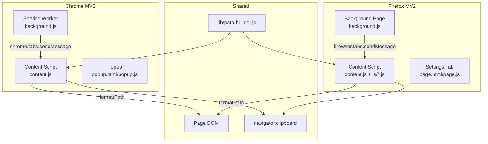

# Forensic Analysis: copy-test-path

## System Overview

A dual-browser Web Extension that exposes a right-click context menu, an element picker, and an inspector mode — all producing DOM selector paths in four formats (Playwright path, CSS selector, XPath, Playwright snippet). The extension has zero runtime dependencies and communicates entirely through Web Extension messaging API.

**Source:** Filed under `chromium/` (Chrome MV3) and `firefox/` (Firefox MV2). Shared path logic lives in `lib/path-builder.js`, symlinked into both browser directories.

## Architecture



### Data Flow — Right-Click Copy

```
User right-clicks element
  → content.js captures e.target as lastRightClicked (capture-phase listener)
  → User clicks menu item in context menu
  → background.js receives contextMenus.onClicked event
  → background.js sends { action } to content.js in correct frame via tab.sendMessage
  → content.js calls formatPath(el, settings) from path-builder.js
  → content.js writes to clipboard (try navigator.clipboard → fallback textarea.execCommand)
  → content.js shows toast, flashes highlight, saves history, broadcasts via BroadcastChannel
```

### Data Flow — Extension Icon

```
User clicks toolbar icon
  → Chrome: background service worker opens popup.html
  → Firefox: background page opens page.html?tab=<sourceTabId> in new tab
  → Settings page reads sourceTabId from URL
  → Action buttons send messages to content script in source tab
  → "Pick element" / "Toggle inspector" switch focus to source tab
```

### Data Flow — Element Picker

```
User clicks "Pick element from page"
  → background.js injects js/picker.js into the page via executeScript
  → picker.js creates a closed shadow DOM host with SVG overlay + dialog
  → Mousemove: elFromPoint() temporarily hides host via display:none!important,
    calls document.elementFromPoint(), restores host
  → Click: copies path to clipboard, shows toast, removes host
```

### Data Flow — Inspector Mode

```
User toggles inspector mode
  → content.js attaches mousemove (passive), click (capture), keydown listeners
  → Closed shadow DOM tooltip follows cursor showing path
  → Click on element: copies path, highlights element, removes listeners
  → Click indicator badge or ESC: removes listeners without copying
```

## Data Model

No database. Two browser storage keys:

### `storage.sync` (shared across browser profile — settings)

| Key | Type | Default | Description |
|-----|------|---------|-------------|
| `format` | string | `'playwright-path'` | Output format: `playwright-path`, `css-selector`, `xpath`, `test-snippet` |
| `highlight` | boolean | `true` | Flash gold outline after copy |
| `shadowDom` | boolean | `true` | Walk across shadow root boundaries |
| `skipTestignore` | boolean | `true` | Skip elements with `data-testignore` |
| `pathDepth` | string | `'all'` | Max segments: `all` or `1`–`5` |

### `storage.local` (per-browser — history)

| Key | Type | Description |
|-----|------|-------------|
| `history` | array | Array of `{ path, format, formatKey, ts }` objects. Max 20 items. |

## API & Interface Contracts

Since this is a browser extension, there are no HTTP endpoints. The API is message-based.

### Message Actions (background → content script)

All messages are plain objects with an `action` field:

#### `get-nav-path`
- **Trigger:** Right-click → "Copy Path"
- **Precondition:** `lastRightClicked` must be set (element was right-clicked)
- **Side effects:** Writes to clipboard, highlights element, shows toast, saves to history, broadcasts
- **Error:** Shows "Right-click an element first" toast if no element was right-clicked

#### `get-url-path`
- **Trigger:** Right-click → "Copy URL + Path"
- **Same as get-nav-path** but prepends `location.href + ' | '` to the path

#### `get-all-testids`
- **Trigger:** Right-click → "Copy All testids on Page"
- **Behavior:** Scans `document.querySelectorAll('[data-testid]')`, deduplicates, sorts
- **Output:** Newline-separated list: `id (×count)` for duplicates, `id` for singles
- **Edge case:** Empty page → outputs `(no data-testid attributes found on this page)`

#### `toggle-inspector`
- **Trigger:** Right-click / extension icon → "Toggle Inspector Mode"
- **State machine:** Toggles between off/on. Injected shadow DOM tooltip + indicator badge.

### Content Script Functions (shared via `var CTP` namespace in Firefox)

The Firefox version uses a global `CTP` namespace:

| Module | Exports | Source |
|--------|---------|--------|
| `CTP.settings` | `init()`, `get(key)`, `getAll()` | `firefox/js/settings.js` |
| `CTP.clipboard` | `copy(text)` → Promise | `firefox/js/clipboard.js` |
| `CTP.highlight` | `apply(el)` | `firefox/js/highlight.js` |
| `CTP.toast` | `show(msg, isError)` | `firefox/js/toast.js` |
| `CTP.log` | `(label, text)` | `firefox/js/log.js` |
| `CTP.history` | `add(path)` → Promise | `firefox/js/history.js` |
| `CTP.broadcast` | `copied(path)` | `firefox/js/broadcast.js` |
| `CTP.inspector` | `toggle(force?)` | `firefox/js/inspector.js` |

Chrome content script (`chromium/content.js`) has all logic inlined as standalone functions.

### Path Builder Functions (global — `lib/path-builder.js`)

| Function | Signature | Returns |
|----------|-----------|---------|
| `siblingIndex(el)` | `(Element) → number` | 1-based index among same-tagName siblings |
| `testContext(el)` | `(Element) → string` | Closest `data-test-context` value or `''` |
| `shouldSkip(el, settings)` | `(Element, Object) → boolean` | True if `data-testignore` present and setting enabled |
| `walkUp(el, segmentFn, settings)` | `(Element, Function, Object) → string[]` | Array of path segments, reversed |
| `segPlaywright(el)` | `(Element) → string` | `testid[data-testlabel="X"]` or `tag[n]` |
| `segCss(el)` | `(Element) → string` | `[data-testid="X"]` or `#id` or `tag:nth-of-type(n)` |
| `segXPath(el)` | `(Element) → string` | `*[@data-testid="X"]` or `tag[n]` |
| `buildPlaywrightPath(el, settings)` | `(Element, Object) → string` | Full path with context prefix |
| `buildCssSelector(el, settings)` | `(Element, Object) → string` | CSS selector |
| `buildXPath(el, settings)` | `(Element, Object) → string` | XPath, slash-separated |
| `buildTestSnippet(el, settings)` | `(Element, Object) → string` | Playwright code snippet |
| `formatPath(el, settings)` | `(Element, Object) → string` | Dispatches to above based on settings.format |
| `getAllTestIds()` | `() → Object` | Map of `testid → count` |
| `formatAllTestIds(map)` | `(Object) → string` | Sorted newline-separated list |

### Path Truncation Rules

- Hard cap at 25 `walkUp` iterations → prepends `...`
- If `settings.pathDepth` is a number > 0, truncates from the front with `…` prefix
- Example: depth=3 on a 10-segment path → `… | seg8 > seg9 > seg10`

### Playwright Snippet Rules

| Element | Suffix |
|---------|--------|
| `<input>` | `.fill('')` |
| `<textarea>` | `.fill('')` |
| `[contenteditable]` | `.fill('')` |
| `<select>` | `.selectOption('')` |
| Everything else | (none) |

## Validation Rules & Business Constraints

### Field-Level
- **`data-testid`**: Non-null string. No format restrictions. Used as-is.
- **`data-testlabel`**: Only meaningful alongside `data-testid`. Appended in `testid[data-testlabel="..."]` form.
- **`data-testignore`**: Boolean attribute (presence-based). No value needed.
- **`data-test-context`**: Arbitrary string value. Prepended with ` | ` separator.

### Cross-Field
- If element has `data-testlabel` but no `data-testid`, the label is ignored.
- If multiple ancestors have `data-test-context`, only the closest is used.

### Domain-Level
- Walk up stops at `<body>` or `<html>` or after 25 steps.
- Shadow DOM traversal: if `cur.parentElement` is null and `cur.getRootNode()` is a `ShadowRoot`, the segment is marked with `{shadow}` and walk continues from `root.host`.
- `data-testignore` only skips the ignored element itself; its children are walked normally.
- Context menu items are re-created on every extension install/update.

## Domain Algorithms

### Segment Generation

```
Input: Element, Settings
Output: Ordered string[] of path segments

1. Start at the right-clicked element
2. depth = 0
3. While cur ≠ document.body and cur ≠ document.documentElement and depth < 25:
   a. If cur has data-testignore and skipTestignore is on:
      - Set cur = cur.parentElement
      - Continue (cur's children are handled by normal walk)
   b. If shadowDom setting is on and cur has no parentElement:
      - Get root = cur.getRootNode()
      - If root is a ShadowRoot and root.host exists:
        - Prepend segmentFn(cur) to result
        - Prepend '{shadow}' marker
        - Set cur = root.host
        - depth += 2
        - Continue
   c. Prepend segmentFn(cur) to result
   d. Set cur = cur.parentElement, depth++
4. If depth >= 25, prepend '...'
5. If pathDepth is a valid number > 0, remove leading segments beyond limit and prepend '…'
6. Prepend testContext(el) with ' | ' if non-empty
```

### Sibling Index

```
Input: Element
Output: 1-based integer

siblings = parent.children filtered by same tagName
return siblings.indexOf(el) + 1
```

### Spotlight SVG Cutout (Picker)

```
ocean path: M0 0 h{vw} v{vh} h-{vw} z M{left} {top} h{width} v{height} h-{width} z
island path: M{left} {top} h{width} v{height} h-{width} z
```

Creates a "hole punch" effect: dim overlay with transparent cutout at element's bounding rect.

### Throttle Strategy

Picker: 30ms throttle on mousemove via `setTimeout` guard.
Inspector: No throttle — every mousemove fires `formatPath` and DOM write.

## Behavioral Observations

### State Machines

#### Inspector Mode
```
       toggle()
         │
    ┌────▼────┐
    │  OFF    │
    └────┬────┘
         │ toggle() / context menu
    ┌────▼────┐
    │   ON    │
    │ Listen: │
    │  - mousemove (tooltip)
    │  - click (copy + exit)
    │  - keydown ESC (exit)
    │  - indicator click (exit)
    └────┬────┘
         │ click element / ESC / indicator click
    ┌────▼────┐
    │  OFF    │
    └─────────┘
```

#### Element Picker
```
    inject
      │
   ┌──▼──┐
   │ ON  │  (no off — self-destructs on copy or quit)
   │ 30ms throttle │
   │ Listen: mousemove, click, keydown, drag │
   └──┬──┘
      │ click element / copy button → copy + quit
      │ ESC / quit button → quit
      └──► host.remove()
```

### Side Effects
- **Clipboard write**: Every copy operation writes to `navigator.clipboard`. If that fails, falls back to `document.execCommand('copy')` via a hidden textarea.
- **History save**: On every copy, `storage.local.history` is updated (async, best-effort).
- **Broadcast**: On every copy, `BroadcastChannel('copy-test-path')` posts `{ type: 'copied', path, format, ts }`.
- **Console log**: Every copy prints a styled log line: `%ccopy-test-path%c Copied: ...`.
- **Settings save**: Every checkbox/select change in the settings UI immediately writes to `storage.sync`.

### Edge Cases Found
1. **No right-click target**: If `lastRightClicked` is null when `get-nav-path` fires (e.g., menu item keyboard shortcut or API call), the Chrome version shows "Right-click an element first" toast. Firefox returns `{ error: 'no element' }`.
2. **Clipboard failure**: If both `navigator.clipboard.writeText` and `execCommand('copy')` fail, the error is caught silently and "Clipboard failed" toast is shown.
3. **Shadow DOM without parent**: Walk-up hits a node with no `parentElement` that is inside a shadow root. The code checks `getRootNode()` for `ShadowRoot` instance.
4. **Body-less document**: Fallback copy checks `if (!document.body)` and rejects early.
5. **Duplicate picker injection**: `if (document.getElementById('ctp-picker-root')) return;`
6. **History capped at 20**: `if (data.history.length > 20) data.history.length = 20;`
7. **Source tab gone**: Settings tab shows "Source tab is no longer available" if the original tab was closed.
8. **Auto-dialog width**: Picker dialog width dynamically adjusts based on path length: `Math.min(420, Math.max(190, Math.ceil(path.length * 8) + 56))`.

## Code Quality Observations

### Duplicated Logic (AI/Vibe-Coding Patterns)

1. **Clipboard logic duplicated**: `chromium/content.js:68-89` and `firefox/js/clipboard.js` have identical `copyToClipboard`/`_fallback` logic. Should be shared.
2. **Highlight logic duplicated**: `chromium/content.js:91-110` and `firefox/js/highlight.js` are identical. Should be shared.
3. **Toast logic duplicated**: `chromium/content.js:112-119` and `firefox/js/toast.js` are near-identical (inline styles vs `Object.assign`). Should be shared.
4. **Inspector logic duplicated**: `chromium/content.js:130-196` and `firefox/js/inspector.js` have the same algorithm but different implementations — Chrome uses direct DOM, Firefox uses closed shadow DOM. Inconsistent design choice rather than intentional difference.
5. **Settings handling duplicated**: `chromium/content.js:8-17,61-65` and `firefox/js/settings.js` do the same thing differently.
6. **Log function duplicated**: `chromium/content.js:121-128` and `firefox/js/log.js` are identical.
7. **Broadcast logic duplicated**: Chrome content script broadcasts inline in the action handlers; Firefox has a dedicated `broadcast.js` module.

### Inconsistencies

1. **Naming**: Chrome uses `hoverEnabled` state variable; Firefox inspector module uses `_enabled`. Chrome's inspector uses `createTooltip()` returning a div; Firefox's `_createTooltip()` returns void and stores references.
2. **Error handling pattern**: Chrome action handlers send `sendResponse({ ok: true })` synchronously. Firefox action handlers return a Promise (which Firefox MV2 uses to keep the channel open).
3. **Context menu item order**: Chrome lists "Pick element from page" only via icon popup, not in context menu. Firefox includes it as a context menu item.
4. **Path depth feature**: Only Firefox settings UI has `pathDepth` control. Chrome popup doesn't include it. However, `walkUp` in `path-builder.js` does check `settings.pathDepth` — meaning Chrome simply uses default `'all'`.
5. **History display**: Firefox page.html shows all 20 history items. Chrome popup shows only first 5.

### Security Gaps

- **`data-testid` content is not sanitized** when inserted into CSS selectors. If a testid contained `"` or `]`, the CSS selector would break. Path-builder wraps values in attribute selectors with hard-coded quotes (`[data-testid="..."]`). If the testid contained a double quote, the selector would be malformed.
- **`contenteditable` check**: `el.isContentEditable` returns true for any editable element, but the snippet appends `.fill('')` which may not be valid for all contenteditable elements.

### Dead Code / Unused Files

- **`firefox/epicker/`**: The iframe-based element picker (`epicker.html`, `epicker.js`) appears to be an older approach. The active picker is the shadow DOM-based `firefox/js/picker.js`. The epicker files are still on disk but not referenced in `manifest.json` or `background.js`.
- **Chrome's `popup.js` imports from `./js/i18n.js`** — but there is no `chromium/js/` directory. This import would fail if not resolved. The actual working path may be different or Chrome popup's i18n.js might not exist. *Observation: The README says Chrome uses a popup, not a new tab, but the popup.html references `script src="popup.js" type="module"` and popup.js imports `./js/i18n.js`. There is no chromium/js/i18n.js file. This is a bug - the Chrome popup would fail to load i18n strings.*
- **`verify.js` line 182** references `firefox/popup.html` and `firefox/popup.js` which don't exist — Firefox uses `page.html`/`page.js`, not popup. The file existence check in verify.js is incorrect.

### Tight Coupling

- **Chrome content.js is monolithic**: All features (clipboard, toast, highlight, inspector, settings, broadcast, history, logging) are in one 198-line file. Cannot unit test individual concerns.
- **Path builder is tested**, but no other module has tests. No tests for clipboard fallback, highlight timing, inspector lifecycle, history limits, or BroadcastChannel behavior.
- **`testContext` walks the DOM** with `el.closest('[data-test-context]')` on every formatPath call — no caching.

### Hallucinated Patterns

- Chrome's popup.js line 97: `api.tabs.executeScript(tab.id, { file: 'js/picker.js' })` — Chrome MV3 doesn't support `tabs.executeScript` in the same way as MV2. It requires the `scripting` permission and `chrome.scripting.executeScript`. This code likely doesn't work in current Chrome.
- Chrome's content.js uses `chrome.storage.sync.get` at line 16, which is correct for MV3 service workers, but the popup uses the `api` shim correctly.
