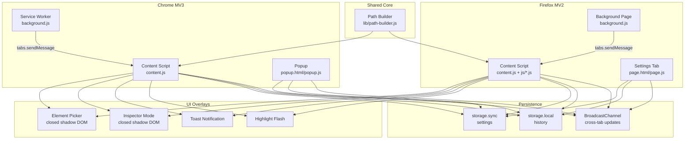
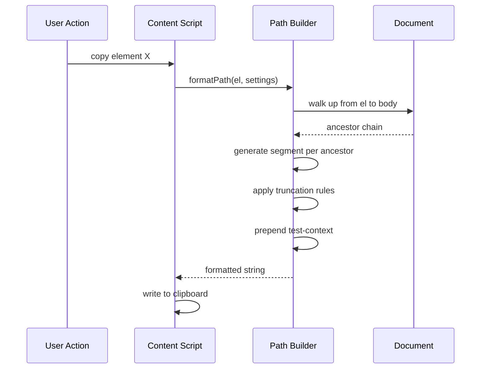
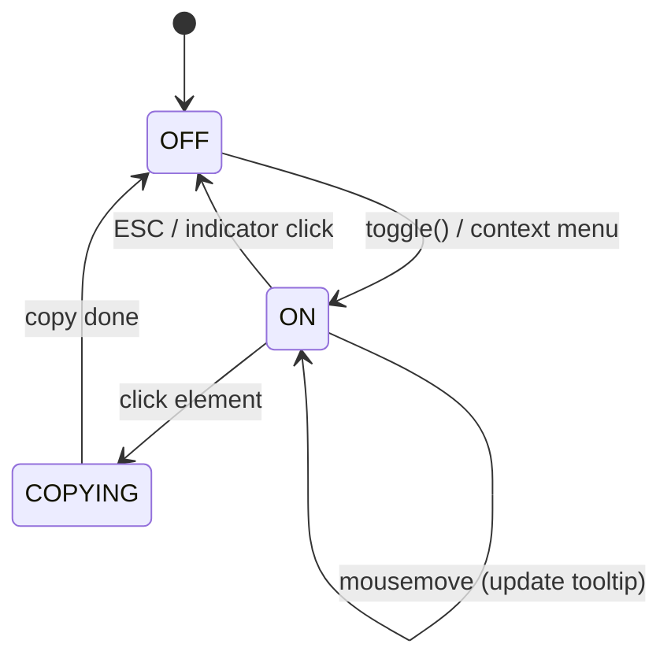
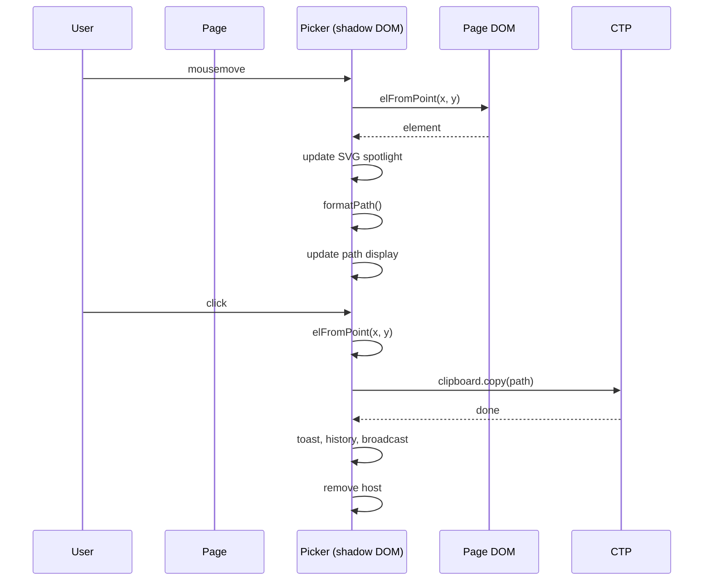

# Build Your Own Browser Extension: copy-test-path

You will build a browser extension that lets you right-click any element on any webpage and copy its DOM selector path for use in E2E tests (Playwright, Cypress, or raw CSS/XPath). The extension supports four output formats, a visual element picker with spotlight overlay, an inspector mode with a floating tooltip, clipboard history, and full cross-browser support for Chrome MV3 and Firefox MV2.

By the end of this tutorial you will have a working browser extension built from scratch.

## What You're Building



The path builder is the shared brain. The content scripts are the hands (one per browser). The overlays (picker, inspector, toast, highlight) are visual feedback injected into the page. Settings and history persist across sessions. BroadcastChannel keeps the settings tab in sync when you copy from another tab.

## Prerequisites

- **Node.js 18+** — for running tests
- **Chrome** and/or **Firefox** — for loading and testing the extension
- **npm** — for installing Playwright (test runner)
- A text editor

## Setup

### 1. Initialize the project

```bash
mkdir copy-test-path
cd copy-test-path
mkdir lib chromium firefox dist
```

### 2. Create the shared path builder stub

You'll build this file incrementally, but create the directory now:

```bash
touch lib/path-builder.js
```

### 3. Set up the test framework

```bash
npm init -y
npm install playwright
```

### 4. Create the Makefile for building

```bash
touch Makefile
```

### 5. Verify

```bash
node -e "console.log('ready')"
```

Output: `ready`

If so, you're ready to build.

---

```
## Chapter 1: Path Builder — Playwright Path Format

**Tier:** Core
**Effort:** High
**Depends on:** None

The path builder is the brain of the extension. It takes a DOM element and produces a selector string in one of four formats. You'll build it first because every other feature depends on it.

Here's the flow for generating a path:



### Step 1: Write the sibling indexing helper

A path needs to distinguish between siblings of the same tag type. For example, if there are three `<div>` elements inside a parent, the second one is `div[2]`.

The index is 1-based and counts only siblings with the same tag name.

Open `lib/path-builder.js` and add:

```javascript
function siblingIndex(el) {
  const p = el.parentElement;
  if (!p) return 1;
  const siblings = Array.from(p.children).filter(c => c.tagName === el.tagName);
  return siblings.indexOf(el) + 1;
}
```

**Verify:**
```bash
node -e "
// Test siblingIndex logic in isolation
const { JSDOM } = require('jsdom');
// If JSDOM not available, skip — the Playwright tests will cover it
console.log('siblingIndex defined');
"
```
Output: `siblingIndex defined`

### Step 2: Write the test-context helper

A `data-test-context` attribute on an ancestor lets you prefix paths with a page or section name. For example, a checkout section might produce paths like `checkout | btn:submit`.

The `testContext` function walks up with `closest()` to find the nearest element with this attribute.

Add to `lib/path-builder.js`:

```javascript
function testContext(el) {
  const ctx = el.closest('[data-test-context]');
  return ctx ? ctx.getAttribute('data-test-context') : '';
}
```

**Verify:**
```bash
node -e "
// Concept check: closest walks UP from the element
// If element is inside <section data-test-context='login'>, result is 'login'
console.log('testContext defined');
"
```

### Step 3: Write the skip-check helper

The `data-testignore` attribute tells the extension to skip an element and use its parent instead. This is useful for skipping decorative wrappers.

```javascript
function shouldSkip(el, settings) {
  return settings.skipTestignore && el.hasAttribute('data-testignore');
}
```

**Verify:**
```bash
node -e "
// If setting is true and element has attribute, skip
// If setting is false, never skip
console.log('shouldSkip defined');
"
```

### Step 4: Write the walk-up algorithm

This is the core traversal. Starting from the right-clicked element, it walks up the DOM tree until it reaches `<body>` or `<html>`, generating one segment per ancestor.

Key rules:
- Hard limit of 25 steps — if exceeded, prepend `...`
- If `data-testignore` is on and current element has the attribute, skip it and use parent
- If shadow DOM traversal is on and element has no `parentElement` (meaning it's in a shadow root), insert `{shadow}` marker and continue from the shadow host
- If `pathDepth` setting is a number > 0, keep only that many trailing segments and prepend `…`

```javascript
function walkUp(el, segmentFn, settings) {
  const segs = [];
  let cur = el;
  let depth = 0;
  while (cur && cur !== document.documentElement && cur !== document.body && depth < 25) {
    if (shouldSkip(cur, settings)) { cur = cur.parentElement; depth++; continue; }
    if (settings.shadowDom) {
      const parent = cur.parentElement;
      if (!parent) {
        const root = cur.getRootNode ? cur.getRootNode() : null;
        if (root instanceof ShadowRoot && root.host && cur !== root.host) {
          segs.unshift(segmentFn(cur));
          segs.unshift('{shadow}');
          cur = root.host;
          depth += 2;
          continue;
        }
      }
    }
    segs.unshift(segmentFn(cur));
    cur = cur.parentElement;
    depth++;
  }
  if (depth >= 25) segs.unshift('...');

  const limit = parseInt(settings.pathDepth, 10);
  if (!isNaN(limit) && limit > 0 && segs.length > limit) {
    return ['…', ...segs.slice(-limit)];
  }
  return segs;
}
```

**How it works:**
1. Start at the element.
2. If it should be skipped, move to parent and try again.
3. If it has no parent (shadow DOM boundary), check if it's inside a `ShadowRoot`. If so, generate its segment, add `{shadow}`, jump to the shadow host, and continue.
4. Otherwise, generate a segment for this element and move up to its parent.
5. Repeat until we hit `<body>`, `<html>`, or the 25-step limit.
6. Apply `pathDepth` truncation if configured.

**Verify:**
```bash
node -e "
// walkUp is the engine — verify it can be defined
console.log(typeof walkUp === 'function' ? 'walkUp is a function' : 'ERROR');
"
```

### Step 5: Write the Playwright path segment generator

The Playwright path format produces segments like:
- `btn:login` (for `data-testid="btn:login"`)
- `div[2]` (for the second `<div>` among its siblings)
- `card[data-testlabel="Pro"]` (for `data-testid` + `data-testlabel`)

```javascript
function segPlaywright(el) {
  const tid = el.getAttribute('data-testid');
  if (tid) {
    const label = el.getAttribute('data-testlabel');
    return label ? `${tid}[data-testlabel="${label}"]` : tid;
  }
  return `${el.tagName.toLowerCase()}[${siblingIndex(el)}]`;
}
```

**Verify:**
```bash
node -e "
// An element with data-testid='btn:go' produces 'btn:go'
// An element with data-testid='card' + data-testlabel='Pro' produces 'card[data-testlabel=\"Pro\"]'
// A plain <div> produces 'div[N]' where N is its sibling index
console.log('segPlaywright defined');
"
```

### Step 6: Write the full Playwright path builder

This combines `testContext` and `walkUp` with `segPlaywright`:

```javascript
function buildPlaywrightPath(el, settings) {
  const ctx = testContext(el);
  const p = walkUp(el, segPlaywright, settings).join(' > ');
  return ctx ? `${ctx} | ${p}` : p;
}
```

**Verify:**
```bash
node -e "
// If no test-context: returns joined segments
// If test-context='login': prepends 'login | '
console.log('buildPlaywrightPath defined');
"
```

### Step 6 (tests)

Create `verify.js`:

```javascript
const { chromium } = require('playwright');
const fs = require('fs');

const P = fs.readFileSync('./lib/path-builder.js', 'utf-8');
const HTML = `
<!DOCTYPE html>
<html><body>
  <div data-test-context="LoginPage">
    <section>
      <form>
        <div data-testignore>
          <label>Email</label>
        </div>
        <input data-testid="email-input" data-testlabel="Email Address" />
        <input data-testid="password-input" type="password" />
        <button data-testid="btn:sign-in">Sign In</button>
      </form>
    </section>
    <div id="shadow-host"></div>
  </div>
  <script>
    const host = document.getElementById('shadow-host');
    const shadow = host.attachShadow({ mode: 'open' });
    shadow.innerHTML = '<span data-testid=\"shadow-item\">shadow</span><div><p data-testid=\"nested-shadow\">nested</p></div>';
  </script>
</body></html>`;

async function main() {
  const browser = await chromium.launch({ headless: true });
  const page = await browser.newPage();
  await page.setContent(HTML);
  await page.waitForFunction(() =>
    document.getElementById('shadow-host').shadowRoot &&
    document.getElementById('shadow-host').shadowRoot.querySelector('[data-testid="nested-shadow"]')
  );

  const results = await page.evaluate((src) => {
    eval(src);
    const settings = { format: 'playwright-path', highlight: true, shadowDom: true, skipTestignore: true };

    const e = document.querySelector('[data-testid="email-input"]');
    const btn = document.querySelector('[data-testid="btn:sign-in"]');
    const lbl = document.querySelector('label');
    const host = document.getElementById('shadow-host');
    const sh = host.shadowRoot.querySelector('[data-testid="shadow-item"]');
    const ns = host.shadowRoot.querySelector('[data-testid="nested-shadow"]');

    return [
      {
        name: 'playwright-path with testid + label',
        pass: buildPlaywrightPath(e, settings) ===
          'LoginPage | div[1] > section[1] > form[1] > email-input[data-testlabel="Email Address"]'
      },
      {
        name: 'shouldSkip keeps children of data-testignore',
        pass: buildPlaywrightPath(lbl, settings) ===
          'LoginPage | div[1] > section[1] > form[1] > label[1]'
      },
      {
        name: 'shadow DOM traversal',
        pass: buildPlaywrightPath(sh, settings) ===
          'div[1] > div[1] > {shadow} > shadow-item'
      },
      {
        name: 'nested shadow DOM',
        pass: buildPlaywrightPath(ns, settings) ===
          'div[1] > div[1] > {shadow} > div[1] > nested-shadow'
      },
      {
        name: 'testContext returns context',
        pass: testContext(e) === 'LoginPage'
      },
    ];
  }, P);

  let pass = 0, fail = 0;
  for (const t of results) {
    console.log(t.pass ? '  ✓' : '  ✗', t.name);
    t.pass ? pass++ : fail++;
  }
  console.log(`\n  ${pass}/${pass + fail} passed\n`);
  await browser.close();
  if (fail > 0) { console.log('FAIL\n'); process.exit(1); }
}
main().catch(e => { console.error('FAILED:', e.message); process.exit(1); });
```

Run it:

```bash
node verify.js
```

Expected: all 5 tests pass.

### Checkpoint

You now have a working Playwright path builder with:
- Test-context prefixing
- data-testignore skipping
- Shadow DOM traversal with `{shadow}` markers
- 25-step hard limit
- pathDepth truncation

---

## Chapter 2: Path Builder — CSS Selector, XPath, and Snippet Formats

**Tier:** Core
**Effort:** Medium
**Depends on:** Chapter 1

You already have the walk-up engine. Now you need three more segment generators and their full path builders.

### Step 1: CSS selector segment generator

CSS segments use `data-testid` attributes (wrapped in `[data-testid="..."]`), element `id` values (`#id`), or `tagName:nth-of-type(n)` as fallback.

Add to `lib/path-builder.js`:

```javascript
function segCss(el) {
  const tid = el.getAttribute('data-testid');
  if (tid) return `[data-testid="${tid}"]`;
  if (el.id) return `#${el.id}`;
  return `${el.tagName.toLowerCase()}:nth-of-type(${siblingIndex(el)})`;
}
```

**Important:** If a `data-testid` value contains a double-quote character, the generated CSS selector will be malformed. In practice this is rare since test IDs are usually alphanumeric with colons and hyphens.

```javascript
function buildCssSelector(el, settings) {
  return walkUp(el, segCss, settings).join(' > ');
}
```

**Verify:**
```bash
node verify.js
```
You'll update the verify script to include CSS tests.

### Step 2: XPath segment generator

XPath uses `*[@data-testid="..."]` for test IDs and `tagName[index]` as fallback. The full path is slash-separated with a leading `/`.

```javascript
function segXPath(el) {
  const tid = el.getAttribute('data-testid');
  if (tid) return `*[@data-testid="${tid}"]`;
  return `${el.tagName.toLowerCase()}[${siblingIndex(el)}]`;
}

function buildXPath(el, settings) {
  return '/' + walkUp(el, segXPath, settings).join('/');
}
```

**Verify:**
```bash
node -e "
// Element with data-testid='email': returns '*[@data-testid=\"email\"]'
// Plain div: returns 'div[2]'
console.log('segXPath and buildXPath defined');
"
```

### Step 3: Playwright snippet generator

This generates a ready-to-paste Playwright statement. Rules:
- If element has `data-testid`: `await page.getByTestId('...')`
- Otherwise: `await page.locator('...')` using the Playwright path
- `<input>`, `<textarea>`, and `[contenteditable]` get `.fill('')` appended
- `<select>` gets `.selectOption('')` appended

```javascript
function buildTestSnippet(el, settings) {
  const path = buildPlaywrightPath(el, settings);
  const tag = el.tagName.toLowerCase();
  const tid = el.getAttribute('data-testid');
  let placeholder = '';
  if (tag === 'input' || tag === 'textarea') placeholder = ".fill('')";
  else if (tag === 'select') placeholder = ".selectOption('')";
  else if (el.isContentEditable) placeholder = ".fill('')";
  if (tid) return `await page.getByTestId('${tid}')${placeholder};`;
  return `await page.locator('${path}')${placeholder};`;
}
```

**Verify:**
```bash
node -e "
// input with testid → await page.getByTestId('email-input').fill('');
// button with testid → await page.getByTestId('btn:sign-in');
// label without testid → await page.locator('...');
console.log('buildTestSnippet defined');
"
```

### Step 4: The format dispatcher

Add the main dispatch function that switches between formats based on `settings.format`:

```javascript
function formatPath(el, settings) {
  switch (settings.format) {
    case 'css-selector': return buildCssSelector(el, settings);
    case 'xpath': return buildXPath(el, settings);
    case 'test-snippet': return buildTestSnippet(el, settings);
    default: return buildPlaywrightPath(el, settings);
  }
}
```

The default is `playwright-path` (or any unrecognized value).

### Step 5: Copy all testids

Two utility functions for the "Copy All testids" feature:

```javascript
function getAllTestIds() {
  const map = {};
  document.querySelectorAll('[data-testid]').forEach(el => {
    const id = el.getAttribute('data-testid');
    if (id) map[id] = (map[id] || 0) + 1;
  });
  return map;
}

function formatAllTestIds(map) {
  const entries = Object.entries(map).sort((a, b) => a[0].localeCompare(b[0]));
  if (entries.length === 0) return '(no data-testid attributes found on this page)';
  return entries.map(([id, c]) => c > 1 ? id + ' (×' + c + ')' : id).join('\n');
}
```

### Step 6: Update verify.js with all format tests

Add these test cases to the `results` array in `verify.js`:

```javascript
{
  name: 'css-selector (button)',
  pass: buildCssSelector(btn, settings) ===
    'div:nth-of-type(1) > section:nth-of-type(1) > form:nth-of-type(1) > [data-testid="btn:sign-in"]'
},
{
  name: 'xpath (email)',
  pass: buildXPath(e, settings) ===
    '/div[1]/section[1]/form[1]/*[@data-testid="email-input"]'
},
{
  name: 'test-snippet (input with testid)',
  pass: buildTestSnippet(e, settings) ===
    "await page.getByTestId('email-input').fill('');"
},
{
  name: 'test-snippet (button)',
  pass: buildTestSnippet(btn, settings) ===
    "await page.getByTestId('btn:sign-in');"
},
{
  name: 'test-snippet (no testid)',
  pass: buildTestSnippet(lbl, settings) ===
    "await page.locator('LoginPage | div[1] > section[1] > form[1] > label[1]');"
},
{
  name: 'getAllTestIds count',
  pass: Object.keys(getAllTestIds()).length === 3
},
```

Run:

```bash
node verify.js
```

Expected: all tests pass.

### Checkpoint

Your `lib/path-builder.js` now generates all four formats and can dump all testids on a page. This file is the shared brain that both browser implementations will use.

---

## Milestone: Chapters 1–2 Complete

At this point your project can:
- Generate Playwright paths, CSS selectors, XPaths, and Playwright snippets from any DOM element
- Handle shadow DOM boundaries, data-testignore, test-context prefixes, and path depth limits
- Collect and format all `data-testid` attributes on a page

Run all of the following and confirm they pass:

```bash
node verify.js
```

Expected: 12 tests passing.

---

```
## Chapter 3: Clipboard, Toast, Highlight, and Logging Utilities

**Tier:** Supporting
**Effort:** Low
**Depends on:** None (standalone helpers)

These utility modules handle the mechanical parts of copying, providing visual feedback, and debugging. In the original project, these were duplicated between browsers; you'll build them once as a clean module.

### Step 1: Clipboard module

The clipboard module tries `navigator.clipboard.writeText` first (standard async API). If that fails (e.g., insecure context or older browser), it falls back to a hidden textarea + `document.execCommand('copy')`.

Create `firefox/js/clipboard.js`:

```javascript
var CTP = CTP || {};

CTP.clipboard = {
  copy(text) {
    return new Promise((resolve, reject) => {
      if (navigator.clipboard && navigator.clipboard.writeText) {
        navigator.clipboard.writeText(text).then(resolve).catch(() => this._fallback(text, resolve, reject));
      } else {
        this._fallback(text, resolve, reject);
      }
    });
  },

  _fallback(text, resolve, reject) {
    if (!document.body) { reject(new Error('no body')); return; }
    const ta = document.createElement('textarea');
    ta.value = text;
    ta.style.cssText = 'position:fixed;left:-9999px;top:-9999px;opacity:0;';
    document.body.appendChild(ta);
    ta.focus();
    ta.select();
    try { document.execCommand('copy'); resolve(); }
    catch { reject(); }
    finally { document.body.removeChild(ta); }
  },
};
```

**Why the fallback exists:** `navigator.clipboard.writeText` requires a secure context (HTTPS or localhost) and the `clipboardWrite` permission. Extension content scripts always have this permission, but the method can still reject in edge cases (e.g., clipboard being accessed by another extension simultaneously).

**Verify:** You can't easily test clipboard in a terminal. The Playwright tests will cover this.

### Step 2: Toast notification

Shows a temporary message in the bottom-right corner of the page. Auto-dismisses after 2 seconds.

Create `firefox/js/toast.js`:

```javascript
var CTP = CTP || {};

CTP.toast = {
  show(msg, isError) {
    if (!document.body) return;
    const el = document.getElementById('ctp-toast');
    if (el) el.remove();
    const d = document.createElement('div');
    d.id = 'ctp-toast';
    d.textContent = msg;
    Object.assign(d.style, {
      position: 'fixed',
      bottom: '24px',
      right: '24px',
      zIndex: '2147483647',
      background: isError ? '#dc2626' : '#1E3A5F',
      color: '#fff',
      font: '13px/1.4 -apple-system, BlinkMacSystemFont, sans-serif',
      padding: '8px 16px',
      borderRadius: '6px',
      boxShadow: '0 2px 10px rgba(0,0,0,0.3)',
      opacity: '1',
      transition: 'opacity 0.3s',
    });
    document.body.appendChild(d);
    setTimeout(() => { d.style.opacity = '0'; setTimeout(() => d.remove(), 300); }, 2000);
  },
};
```

**Key design choice:** z-index `2147483647` is the maximum possible, ensuring the toast appears above everything on the page (including iframes and other overlays).

### Step 3: Highlight flash

When an element's path is copied, briefly flash a gold outline and tint to give visual confirmation.

Create `firefox/js/highlight.js`:

```javascript
var CTP = CTP || {};

CTP.highlight = {
  _timer: null,

  apply(el) {
    if (this._timer) clearTimeout(this._timer);
    const orig = {
      outline: el.style.outline,
      outlineOffset: el.style.outlineOffset,
      background: el.style.background,
      transition: el.style.transition,
    };
    Object.assign(el.style, {
      outline: '2px solid #FFD700',
      outlineOffset: '2px',
      background: 'rgba(255,215,0,0.12)',
      transition: 'outline 0.3s, background 0.3s',
    });
    this._timer = setTimeout(() => {
      Object.assign(el.style, orig);
      this._timer = null;
    }, 1200);
  },
};
```

**Why 1200ms:** Long enough to notice, short enough not to be annoying. The 300ms transition ensures a smooth fade.

### Step 4: Logging helper

Styled console output for debugging. Prefixes each message with a `copy-test-path` badge.

Create `firefox/js/log.js`:

```javascript
var CTP = CTP || {};

CTP.log = function(label, text) {
  const s = text == null ? '' : String(text);
  const preview = s.length > 120 ? s.slice(0, 120) + '\u2026' : s;
  console.log(
    '%ccopy-test-path%c ' + label + ': ' + preview,
    'background:#1E3A5F;color:#FFD700;padding:2px 6px;border-radius:4px;font-weight:700;',
    'color:#0f172a;'
  );
};
```

**Verify:** Open the browser console and run `CTP.log('Test', 'hello')` after the content script loads. Expected output: styled badge + message.

### Checkpoint

You now have reusable utility modules. These will be wired into the content script later.

---

## Chapter 4: History and BroadcastChannel

**Tier:** Supporting
**Effort:** Low
**Depends on:** None

The extension stores the last 20 copied paths so users can re-copy them without revisiting the page. When a path is copied in any tab, the settings page (if open) should update its history display live — that's what BroadcastChannel is for.

### Step 1: History module

History uses `browser.storage.local` (not `sync`) because:
- It can get large (20 paths × ~100 chars each)
- It's per-browser, not cross-device
- It's purely local convenience, not a setting

Create `firefox/js/history.js`:

```javascript
var CTP = CTP || {};

const FORMAT_KEYS = {
  'playwright-path': 'formatPlaywrightPath',
  'css-selector': 'formatCssSelector',
  'xpath': 'formatXPath',
  'test-snippet': 'formatTestSnippet',
};

CTP.history = {
  async add(path) {
    const data = await browser.storage.local.get({ history: [] });
    const format = CTP.settings.get('format');
    data.history.unshift({
      path,
      format,
      formatKey: FORMAT_KEYS[format] || 'formatPlaywrightPath',
      ts: Date.now(),
    });
    if (data.history.length > 20) data.history.length = 20;
    await browser.storage.local.set({ history: data.history });
  },
};
```

**Why `unshift`:** Newest items go at the front. The settings page iterates from index 0 to show most-recent-first.

**Why cap at 20:** Enough to be useful, small enough to avoid storage quota issues. `storage.local` typically has a 5–10 MB limit; 20 paths is negligible.

### Step 2: BroadcastChannel module

BroadcastChannel lets multiple browsing contexts (tabs, iframes) on the same origin communicate. The extension uses a channel named `'copy-test-path'` to notify all open copies of the settings page when a path is copied.

Create `firefox/js/broadcast.js`:

```javascript
var CTP = CTP || {};

CTP.broadcast = {
  _channel: new BroadcastChannel('copy-test-path'),

  copied(path) {
    this._channel.postMessage({ type: 'copied', path, format: CTP.settings.get('format'), ts: Date.now() });
  },
};
```

The settings page listens on this channel and refreshes its history display when a `copied` message arrives.

**Verify:**
```bash
node -e "
// BroadcastChannel is a native browser API
// In an extension context, all tabs share the same origin
// so messages posted from one tab are received by all
console.log('BroadcastChannel concept ready');
"
```

### Checkpoint

History and cross-tab communication are ready. The settings page will wire these together in Chapter 8.

---

## Chapter 5: Firefox Content Script and Background

**Tier:** Core
**Effort:** Medium
**Depends on:** Chapters 1–4

Now you'll wire everything together for Firefox. The content script receives messages from the background page and orchestrates all the modules you've built.

### Step 1: Settings module

Settings are persisted via `browser.storage.sync` (shared across browser profile — e.g., Firefox Sync). The module loads defaults on initialization and listens for changes from other contexts (e.g., the settings tab).

Create `firefox/js/settings.js`:

```javascript
var CTP = CTP || {};

CTP.settings = {
  _data: {
    format: 'playwright-path',
    highlight: true,
    shadowDom: true,
    skipTestignore: true,
    pathDepth: 'all',
  },

  async init() {
    const stored = await browser.storage.sync.get(this._data);
    Object.assign(this._data, stored);
    browser.storage.onChanged.addListener(changes => {
      for (const [key, { newValue }] of Object.entries(changes)) {
        if (key in this._data) this._data[key] = newValue;
      }
    });
  },

  getAll() {
    return { ...this._data };
  },

  get(key) {
    return this._data[key];
  },
};
```

**Why merge defaults with stored:** On first run, nothing is stored yet. The defaults ensure sensible behavior. `storage.sync.get(defaults)` returns merged result: stored values override defaults only where the user has set something.

The `onChanged` listener keeps the in-memory cache in sync without re-reading storage on every copy operation.

### Step 2: Firefox content script

The Firefox content script is a thin dispatcher. It initializes settings, captures the right-click target, and handles incoming messages.

Create `firefox/content.js`:

```javascript
let lastRightClicked = null;

(async () => {
  await CTP.settings.init();

  document.addEventListener('contextmenu', e => {
    lastRightClicked = (e.target && e.target.nodeType === Node.ELEMENT_NODE) ? e.target : document.activeElement;
  }, true);

  browser.runtime.onMessage.addListener((msg) => {
    const action = msg.action;

    if (action === 'get-nav-path' || action === 'get-url-path') {
      if (!lastRightClicked) return Promise.resolve({ error: 'no element' });
      const el = lastRightClicked;
      lastRightClicked = null;
      let text = formatPath(el, CTP.settings.getAll());
      if (action === 'get-url-path') text = location.href + ' | ' + text;
      return CTP.clipboard.copy(text).then(() => {
        if (CTP.settings.get('highlight')) CTP.highlight.apply(el);
        CTP.toast.show('Copied!');
        CTP.log('Copied', text);
        CTP.history.add(text).catch(() => {});
        CTP.broadcast.copied(text);
        return { ok: true };
      }).catch(() => {
        CTP.toast.show('Clipboard failed', true);
        return { ok: false };
      });
    }

    if (action === 'get-all-testids') {
      const map = getAllTestIds();
      const text = formatAllTestIds(map);
      return CTP.clipboard.copy(text).then(() => {
        const n = Object.keys(map).length;
        CTP.toast.show('Copied ' + n + ' testid' + (n !== 1 ? 's' : ''));
        CTP.log('Copied ' + n + ' testid' + (n !== 1 ? 's' : ''), text.slice(0, 80));
        return { ok: true };
      }).catch(() => {
        CTP.toast.show('Clipboard failed', true);
        return { ok: false };
      });
    }

    if (action === 'toggle-inspector') {
      CTP.inspector.toggle();
      return Promise.resolve({});
    }
  });
})();
```

**Key pattern:** Firefox's `runtime.onMessage` supports returning a Promise to keep the message channel open for async operations. Chrome uses a `sendResponse` callback instead. This is the main divergence between the two browser implementations.

**Why `lastRightClicked` is consumed and reset to null:** After a right-click, the user will see the context menu. They may right-click again before making a selection (which would replace `lastRightClicked`). Consuming it on the first copy action ensures stale elements aren't accidentally copied.

### Step 3: Firefox background script (page)

The background page creates the context menu items and handles clicks. It maps menu item IDs to action names and sends messages to the content script.

Create `firefox/background.js`:

```javascript
function createContextMenus() {
  browser.contextMenus.removeAll().then(() => {
    browser.contextMenus.create({ id: 'copy-nav-path', title: 'Copy Path', contexts: ['all'] });
    browser.contextMenus.create({ id: 'copy-url-path', title: 'Copy URL + Path', contexts: ['all'] });
    browser.contextMenus.create({ id: 'separator-1', type: 'separator', contexts: ['all'] });
    browser.contextMenus.create({ id: 'pick-element', title: 'Pick element from page', contexts: ['page'] });
    browser.contextMenus.create({ id: 'copy-all-testids', title: 'Copy All testids on Page', contexts: ['all'] });
    browser.contextMenus.create({ id: 'toggle-inspector', title: 'Toggle Inspector Mode', contexts: ['all'] });
  });
}

browser.runtime.onInstalled.addListener(createContextMenus);
createContextMenus();

browser.browserAction.onClicked.addListener((tab) => {
  browser.tabs.create({ url: browser.runtime.getURL('page.html') + '?tab=' + tab.id });
});

browser.contextMenus.onClicked.addListener((info, tab) => {
  if (info.menuItemId === 'pick-element') {
    browser.tabs.executeScript(tab.id, { file: 'js/picker.js', frameId: info.frameId })
      .catch(err => console.warn('copy-test-path:', err.message));
    return;
  }

  const actionMap = {
    'copy-nav-path': 'get-nav-path',
    'copy-url-path': 'get-url-path',
    'copy-all-testids': 'get-all-testids',
    'toggle-inspector': 'toggle-inspector',
  };
  const action = actionMap[info.menuItemId];
  if (!action) return;

  browser.tabs.sendMessage(tab.id, { action }, { frameId: info.frameId })
    .catch(err => console.warn('copy-test-path:', err.message));
});
```

**Why `contexts: ['page']` for pick-element:** The element picker only works on actual web pages (not chrome:// URLs or extension pages).

**Why `frameId` matters:** A page may have iframes. The right-click could happen inside an iframe. Passing `frameId` ensures the content script in the correct frame receives the message.

### Step 4: Firefox manifest

Create `firefox/manifest.json`:

```json
{
  "manifest_version": 2,
  "name": "__MSG_extName__",
  "version": "3.1.0",
  "default_locale": "en",
  "description": "__MSG_extDescription__",
  "permissions": [
    "contextMenus",
    "clipboardWrite",
    "activeTab",
    "storage",
    "<all_urls>"
  ],
  "background": {
    "scripts": ["background.js"],
    "persistent": true
  },
  "content_scripts": [
    {
      "matches": ["<all_urls>"],
      "js": [
        "lib/path-builder.js",
        "js/log.js",
        "js/clipboard.js",
        "js/toast.js",
        "js/highlight.js",
        "js/settings.js",
        "js/broadcast.js",
        "js/history.js",
        "js/inspector.js",
        "content.js"
      ],
      "run_at": "document_end"
    }
  ],
  "browser_action": {
    "default_title": "__MSG_extName__"
  },
  "browser_specific_settings": {
    "gecko": {
      "id": "ui-path-copy@ui",
      "strict_min_version": "91.0"
    }
  }
}
```

**Why load order matters for content scripts:** `path-builder.js` must be first because it defines global functions (`formatPath`, `getAllTestIds`, etc.). The `CTP.*` modules (log, clipboard, toast, highlight, settings, broadcast, history, inspector) must load before `content.js` because content.js references `CTP.settings`, `CTP.clipboard`, etc.

**Why `browser_specific_settings.gecko.id` is required:** Firefox requires a stable extension ID for signed add-ons and for features like `storage.sync`. Without it, `storage.sync` may not work correctly during development.

### Step 5: Symlink the path builder

```bash
ln -s ../../lib/path-builder.js firefox/lib/path-builder.js
```

Firefox's content script includes `lib/path-builder.js` from the `firefox/` directory. The symlink ensures only one canonical source exists.

### Step 6: i18n module

Create `firefox/js/i18n.js`:

```javascript
const i18n = (typeof browser !== 'undefined' && browser.i18n ? browser : chrome).i18n;

export function msg(key, substitutions) {
  return i18n.getMessage(key, substitutions) || key;
}

export function render() {
  for (const el of document.querySelectorAll('[data-i18n]')) {
    const text = msg(el.getAttribute('data-i18n'));
    if (text) el.textContent = text;
  }
  for (const el of document.querySelectorAll('[data-i18n-title]')) {
    const text = msg(el.getAttribute('data-i18n-title'));
    if (text) el.setAttribute('title', text);
  }
  for (const el of document.querySelectorAll('[data-i18n-placeholder]')) {
    const text = msg(el.getAttribute('data-i18n-placeholder'));
    if (text) el.setAttribute('placeholder', text);
  }
}
```

This is an ES module (uses `export`). It's imported by `page.js`.

Create `firefox/_locales/en/messages.json` with English strings:

```json
{
  "extName": { "message": "copy-test-path", "description": "Extension name" },
  "extDescription": { "message": "Right-click any element to copy its selector path for E2E tests", "description": "Extension description" },
  "popupTitle": { "message": "copy-test-path", "description": "Popup heading" },
  "popupSubtitle": { "message": "Right-click any element and copy its selector path, or configure defaults below.", "description": "Popup subtitle" },
  "formatLabel": { "message": "Output format", "description": "Label for format selector" },
  "formatPlaywrightPath": { "message": "Playwright path (tag[n] + testid)", "description": "Playwright path format option" },
  "formatCssSelector": { "message": "CSS selector (nth-of-type)", "description": "CSS selector format option" },
  "formatXPath": { "message": "XPath", "description": "XPath format option" },
  "formatTestSnippet": { "message": "Playwright snippet", "description": "Playwright snippet format option" },
  "highlightLabel": { "message": "Highlight on copy", "description": "Checkbox label for highlight feature" },
  "shadowDomLabel": { "message": "Traverse shadow DOM", "description": "Checkbox label for shadow DOM traversal" },
  "skipTestignoreLabel": { "message": "Skip data-testignore", "description": "Checkbox label for skipping testignore elements" },
  "copyAllButton": { "message": "Copy All testids on Page", "description": "Button to copy all data-testid attributes" },
  "inspectorButton": { "message": "Toggle Inspector Mode", "description": "Button to toggle inspector mode" },
  "pickElementButton": { "message": "Pick element from page", "description": "Button to launch element picker" },
  "contextMenuPickElement": { "message": "Pick element from page", "description": "Context menu item to launch element picker" },
  "statusDone": { "message": "Done!", "description": "Success status message" },
  "statusNotLoaded": { "message": "Content script not loaded on this page", "description": "Error when content script not available" },
  "copiedToast": { "message": "Copied!", "description": "Toast shown after copying" },
  "clipboardFailed": { "message": "Clipboard failed", "description": "Error when clipboard write fails" },
  "inspectorModeIndicator": { "message": "Inspector — click to copy · click here to exit", "description": "Inspector mode indicator text" },
  "contextMenuCopyPath": { "message": "Copy Path", "description": "Context menu item to copy element path" },
  "contextMenuCopyUrlPath": { "message": "Copy URL + Path", "description": "Context menu item to copy URL and element path" },
  "contextMenuCopyAllTestIds": { "message": "Copy All testids on Page", "description": "Context menu item to copy all testids" },
  "contextMenuToggleInspector": { "message": "Toggle Inspector Mode", "description": "Context menu item to toggle inspector" },
  "Behaviors": { "message": "Behaviors", "description": "Section header for behavior settings" },
  "pathDepthLabel": { "message": "Path depth (segments shown)", "description": "Label for path depth selector" }
}
```

**Verify:**
```bash
# Basic structure check
test -f firefox/content.js && test -f firefox/background.js && test -f firefox/manifest.json && echo "Firefox files ready"
```

### Checkpoint

You can now load the Firefox extension:

1. Open `about:debugging` in Firefox
2. Click **This Firefox** → **Load Temporary Add-on…**
3. Select `firefox/manifest.json`
4. Right-click any element → you should see the copy-test-path submenu

The menu items appear, but copy won't work yet — you still need the settings page and the inspector module, which come in the next chapters.

---

## Chapter 6: Inspector Mode

**Tier:** Core
**Effort:** Medium
**Depends on:** Chapters 1–4, 5

Inspector mode is a persistent hover-to-copy overlay. When active, a floating tooltip follows your cursor showing the element's path. Click any element to copy its path and exit. Click the indicator badge or press ESC to exit without copying.



### Step 1: Inspector module

Create `firefox/js/inspector.js`:

```javascript
var CTP = CTP || {};

CTP.inspector = {
  _enabled: false,
  _tooltip: null,
  _tooltipContent: null,
  _indicator: null,
  _currentEl: null,
  _onHover: null,
  _onClick: null,
  _onKeyDown: null,

  toggle(force) {
    const enable = force !== undefined ? force : !this._enabled;
    this._enabled = enable;
    if (enable) {
      this._onHover = e => this._onHoverHandler(e);
      this._onClick = e => this._onClickHandler(e);
      this._onKeyDown = e => { if (e.key === 'Escape') this.toggle(false); };
      this._createTooltip();
      this._createIndicator();
      document.addEventListener('mousemove', this._onHover, { passive: true });
      document.addEventListener('click', this._onClick, true);
      document.addEventListener('keydown', this._onKeyDown, true);
    } else {
      if (this._tooltip) { this._tooltip.remove(); this._tooltip = null; }
      if (this._indicator) { this._indicator.remove(); this._indicator = null; }
      this._tooltipContent = null;
      document.removeEventListener('mousemove', this._onHover);
      document.removeEventListener('click', this._onClick, true);
      document.removeEventListener('keydown', this._onKeyDown, true);
      this._currentEl = null;
      this._onHover = null;
      this._onClick = null;
      this._onKeyDown = null;
    }
  },

  _createTooltip() {
    if (!document.body) return;
    const host = document.createElement('div');
    host.id = 'ctp-tooltip';
    host.style.cssText = 'position:fixed;z-index:2147483647;pointer-events:none;display:none;';
    const shadow = host.attachShadow({ mode: 'closed' });
    shadow.innerHTML = `
      <style>
        :host { all: initial; display: block; }
        .tooltip {
          background: #1E3A5F; color: #FFD700;
          font: 12px/1.4 'SF Mono', 'Cascadia Code', Menlo, Consolas, monospace;
          padding: 5px 10px; border-radius: 4px;
          max-width: 520px; white-space: nowrap;
          overflow: hidden; text-overflow: ellipsis;
          box-shadow: 0 2px 10px rgba(0,0,0,0.35);
          direction: rtl;
        }
      </style>
      <div class="tooltip"></div>
    `;
    this._tooltipContent = shadow.querySelector('.tooltip');
    document.body.appendChild(host);
    this._tooltip = host;
  },

  _createIndicator() {
    if (!document.body) return;
    const host = document.createElement('div');
    host.id = 'ctp-indicator';
    const shadow = host.attachShadow({ mode: 'closed' });
    shadow.innerHTML = `
      <style>
        :host { all: initial; position: fixed; top: 12px; right: 12px; z-index: 2147483647; cursor: pointer; }
        .indicator {
          background: #1E3A5F; color: #FFD700;
          font: 13px/1.4 -apple-system, BlinkMacSystemFont, 'Segoe UI', sans-serif;
          padding: 8px 16px; border-radius: 6px;
          box-shadow: 0 2px 14px rgba(0,0,0,0.35);
        }
      </style>
      <div class="indicator">Inspector — click to copy · click here to exit</div>
    `;
    shadow.querySelector('.indicator').addEventListener('click', () => this.toggle(false));
    document.body.appendChild(host);
    this._indicator = host;
  },

  _onHoverHandler(e) {
    const el = document.elementFromPoint(e.clientX, e.clientY);
    if (!el || el === this._currentEl || el.id === 'ctp-indicator' || el.id === 'ctp-tooltip') return;
    this._currentEl = el;
    const path = formatPath(el, CTP.settings.getAll());
    if (!this._tooltipContent) return;
    this._tooltipContent.textContent = path;
    this._tooltip.style.display = 'block';
    let x = e.clientX + 18, y = e.clientY + 18;
    if (x + 520 > innerWidth) x = e.clientX - 530;
    if (y + 30 > innerHeight) y = e.clientY - 40;
    this._tooltip.style.left = x + 'px';
    this._tooltip.style.top = y + 'px';
  },

  _onClickHandler(e) {
    const el = document.elementFromPoint(e.clientX, e.clientY);
    if (!el || el.id === 'ctp-tooltip' || el.id === 'ctp-indicator') return;
    e.preventDefault();
    e.stopPropagation();
    const path = formatPath(el, CTP.settings.getAll());
    if (!path) return;

    CTP.clipboard.copy(path).then(() => {
      CTP.highlight.apply(el);
      CTP.toast.show('Copied!');
      CTP.log('Inspector copied', path);
      CTP.history.add(path).catch(() => {});
      CTP.broadcast.copied(path);
      this.toggle(false);
    }).catch(() => CTP.toast.show('Clipboard failed', true));
  },
};
```

**Why closed shadow DOM for the tooltip:** An open shadow root would let the page's CSS leak in and the page's JavaScript could query the tooltip elements. A closed shadow root ensures complete isolation — the tooltip always renders correctly regardless of the page's styles.

**Why `direction: rtl` on the tooltip:** This makes long paths truncate from the left (showing the element name, not the body), which is more useful when the path is too long to fit.

**Why `elementFromPoint` is called on every mouse event:** The inspector needs to know what element is under the cursor right now. Using `e.target` would give the tooltip's shadow host (which is on top). `elementFromPoint` sees through transparent overlays.

**Why `pointer-events:none` on the tooltip:** The tooltip must not intercept click events — clicks should pass through to the underlying element. The indicator badge has `cursor: pointer` and its own click handler.

### Step 2: Verify by loading the extension

1. Reload the extension in `about:debugging`
2. Right-click any page → **Toggle Inspector Mode**
3. You should see the gold indicator badge in the top-right corner
4. Move your mouse — the tooltip should follow, showing element paths
5. Click an element — path is copied, inspector exits
6. Click the indicator badge or press ESC — inspector exits without copying

**Verify:**
```bash
# No automated test for this — it's visual/interactive
echo "Inspector mode ready — test manually in Firefox"
```

### Checkpoint

Inspector mode works. You can hover any element, see its path in real-time, and click to copy.

---

## Chapter 7: Element Picker

**Tier:** Core
**Effort:** High
**Depends on:** Chapters 1–4, 5

The element picker is a full-page overlay with a spotlight effect. It dims the page, highlights the element under your cursor with a gold cutout, shows the path in a floating dialog, and lets you click to copy. The dialog is draggable.



### Step 1: The picker module

Create `firefox/js/picker.js`:

```javascript
(function() {
  if (document.getElementById('ctp-picker-root')) return;

  const host = document.createElement('div');
  host.id = 'ctp-picker-root';
  Object.assign(host.style, {
    position: 'fixed',
    top: '0',
    left: '0',
    width: '100%',
    height: '100%',
    zIndex: '2147483647',
    pointerEvents: 'none',
  });

  const shadow = host.attachShadow({ mode: 'closed' });
  shadow.innerHTML = `
    <style>
      *, *::before, *::after { box-sizing: border-box; }
      #overlay {
        position: fixed;
        top: 0; left: 0;
        width: 100vw; height: 100vh;
        cursor: crosshair;
        pointer-events: auto;
      }
      #dialog {
        position: fixed;
        bottom: 20px; right: 20px;
        min-width: 190px; max-width: 420px;
        background: #fff;
        border-radius: 10px;
        box-shadow: 0 4px 24px rgba(0,0,0,.25), 0 1px 4px rgba(0,0,0,.1);
        overflow: hidden;
        font-family: -apple-system, BlinkMacSystemFont, 'Segoe UI', sans-serif;
        font-size: 13px;
        color: #1e293b;
        pointer-events: auto;
        z-index: 1;
      }
      #dialog-header {
        display: flex; align-items: center; justify-content: space-between;
        padding: 10px 14px; background: #1E3A5F; color: #FFD700;
        font-weight: 600; font-size: 13px;
        cursor: move;
        user-select: none;
        white-space: nowrap;
      }
      #quitBtn {
        background: none; border: none; color: #FFD700;
        font-size: 20px; cursor: pointer; padding: 0 4px; line-height: 1; opacity: .7;
      }
      #quitBtn:hover { opacity: 1; }
      #path-display {
        padding: 12px 14px;
        font-family: 'SF Mono', 'Cascadia Code', 'Fira Code', Menlo, Consolas, monospace;
        font-size: 12px; color: #1e293b; background: #f8fafc;
        border-bottom: 1px solid #e2e8f0;
        word-break: break-all; line-height: 1.5;
        min-height: 40px; max-height: 120px; overflow-y: auto; white-space: pre-wrap;
      }
      #dialog-actions { padding: 10px 14px; display: flex; justify-content: flex-end; gap: 8px; }
      .primary {
        padding: 7px 18px; border: none; border-radius: 6px;
        font-size: 13px; font-weight: 600; cursor: pointer;
        background: #1E3A5F; color: #FFD700;
      }
      .primary:hover { background: #2a5070; }
      .primary:active { background: #16304a; }
    </style>
    <svg id="overlay" xmlns="http://www.w3.org/2000/svg">
      <path id="ocean" fill="rgba(0,0,0,0.4)" fill-rule="evenodd" d="" />
      <path id="island" fill="rgba(255,215,0,0.2)" stroke="#FFD700" stroke-width="2" d="" />
    </svg>
    <div id="dialog">
      <div id="dialog-header">
        <span>Element picker</span>
        <button id="quitBtn" title="Quit">&times;</button>
      </div>
      <div id="path-display">Hover over an element\u2026</div>
      <div id="dialog-actions">
        <button id="copyBtn" class="primary">Copy path</button>
      </div>
    </div>
  `;

  document.documentElement.appendChild(host);

  const overlay    = shadow.querySelector('#overlay');
  const ocean      = shadow.querySelector('#ocean');
  const island     = shadow.querySelector('#island');
  const dialog     = shadow.querySelector('#dialog');
  const dialogHeader = shadow.querySelector('#dialog-header');
  const pathDisplay = shadow.querySelector('#path-display');
  const copyBtn    = shadow.querySelector('#copyBtn');
  const quitBtn    = shadow.querySelector('#quitBtn');

  let currentEl   = null;
  let currentPath = '';
  let dragging    = false;
  let dragOffsetX = 0;
  let dragOffsetY = 0;

  function elFromPoint(x, y) {
    host.style.setProperty('display', 'none', 'important');
    const el = document.elementFromPoint(x, y);
    host.style.removeProperty('display');
    return el;
  }

  function updateHighlight(el) {
    const rect = el.getBoundingClientRect();
    const vw = window.innerWidth;
    const vh = window.innerHeight;
    const path = typeof formatPath === 'function' ? formatPath(el, CTP.settings.getAll()) : el.tagName;
    currentEl = el;
    currentPath = path;
    pathDisplay.textContent = path;
    if (!dragging) {
      const w = Math.min(420, Math.max(190, Math.ceil(path.length * 8) + 56));
      dialog.style.width = w + 'px';
    }
    ocean.setAttribute('d', `M0 0h${vw}v${vh}h-${vw}z M${rect.left} ${rect.top}h${rect.width}v${rect.height}h-${rect.width}z`);
    island.setAttribute('d', `M${rect.left} ${rect.top}h${rect.width}v${rect.height}h-${rect.width}z`);
  }

  function doCopy() {
    if (!currentPath) return;
    CTP.clipboard.copy(currentPath).then(() => {
      CTP.history.add(currentPath).catch(() => {});
      CTP.broadcast.copied(currentPath);
      CTP.toast.show('Copied!');
      setTimeout(quit, 500);
    }).catch(() => CTP.toast.show('Clipboard failed', true));
  }

  function quit() {
    overlay.removeEventListener('mousemove', onMouseMove);
    overlay.removeEventListener('click', onOverlayClick);
    dialogHeader.removeEventListener('mousedown', onDragStart);
    document.removeEventListener('mousemove', onDragMove);
    document.removeEventListener('mouseup', onDragEnd);
    document.removeEventListener('keydown', onKeyDown, true);
    host.remove();
  }

  let throttleTimer = null;
  function onMouseMove(e) {
    if (dragging) return;
    if (throttleTimer) return;
    throttleTimer = setTimeout(() => { throttleTimer = null; }, 30);
    const el = elFromPoint(e.clientX, e.clientY);
    if (!el || el === currentEl) return;
    updateHighlight(el);
  }

  function onOverlayClick(e) {
    if (dragging) return;
    e.preventDefault();
    e.stopPropagation();
    const el = elFromPoint(e.clientX, e.clientY);
    if (!el) return;
    updateHighlight(el);
    doCopy();
  }

  function onKeyDown(e) {
    if (e.key === 'Escape') quit();
  }

  function onDragStart(e) {
    if (e.target === quitBtn) return;
    dragging = true;
    const rect = dialog.getBoundingClientRect();
    dragOffsetX = e.clientX - rect.left;
    dragOffsetY = e.clientY - rect.top;
    dialog.style.left   = rect.left + 'px';
    dialog.style.top    = rect.top  + 'px';
    dialog.style.right  = 'auto';
    dialog.style.bottom = 'auto';
    e.preventDefault();
  }

  function onDragMove(e) {
    if (!dragging) return;
    const x = Math.max(0, Math.min(e.clientX - dragOffsetX, window.innerWidth  - dialog.offsetWidth));
    const y = Math.max(0, Math.min(e.clientY - dragOffsetY, window.innerHeight - dialog.offsetHeight));
    dialog.style.left = x + 'px';
    dialog.style.top  = y + 'px';
  }

  function onDragEnd() {
    dragging = false;
  }

  copyBtn.addEventListener('click', doCopy);
  quitBtn.addEventListener('click', quit);
  overlay.addEventListener('mousemove', onMouseMove);
  overlay.addEventListener('click', onOverlayClick);
  dialogHeader.addEventListener('mousedown', onDragStart);
  document.addEventListener('mousemove', onDragMove);
  document.addEventListener('mouseup', onDragEnd);
  document.addEventListener('keydown', onKeyDown, true);
})();
```

**How the SVG spotlight works:**

The overlay is a full-viewport SVG element. Two paths are layered:

1. **`ocean` path:** A rectangle covering the entire viewport with a cutout hole at the element's bounding box. The `fill-rule="evenodd"` SVG property makes the inner rectangle a hole (the "outside" is darkened, the "inside" is transparent).
   - `M0 0h${vw}v${vh}h-${vw}z` — big rectangle covering the whole viewport (clockwise)
   - `M${left} ${top}h${width}v${height}h-${width}z` — inner rectangle (same clockwise direction, so evenodd makes it a hole)

2. **`island` path:** A semi-transparent gold overlay matching the element's bounding box. This highlights the element.

The SVG path syntax: `M` = move to, `h` = horizontal line, `v` = vertical line, `z` = close path.

**Why `elFromPoint` temporarily hides the host:**

`document.elementFromPoint(x, y)` returns the topmost element at those coordinates. The picker's shadow host is positioned over everything, so without hiding it, `elementFromPoint` would always return the shadow host. The solution: temporarily set `display: none !important` on the host (inline style with `!important` to override any page CSS), call `elementFromPoint`, then restore. This all happens synchronously so there's no visible flash.

**Why 30ms throttle on mousemove:**

Mousemove fires at ~60fps (every 16ms). But `elFromPoint` involves forced layout (hiding/showing the host) and `getBoundingClientRect`. Running this at full framerate would be wasteful — 30ms throttle (about 33fps) is smooth enough for the highlight to feel responsive.

**Dialog width auto-resize:**

The dialog width adjusts based on path length: `Math.min(420, Math.max(190, Math.ceil(path.length * 8) + 56))`. This ensures short paths get a compact dialog and long paths don't overflow. The 8 multiplier is an approximation of character width in the monospace font at 12px. Once the user starts dragging, width stops auto-resizing.

### Step 2: Verify

1. Reload the extension in `about:debugging`
2. Right-click any page → **Pick element from page**
3. The page should dim with a spotlight following your cursor
4. A dialog should show the element path in real-time
5. Click an element → path is copied, picker closes
6. Press ESC → picker closes without copying

**Verify:**
```bash
echo "Element picker ready — test manually in Firefox"
```

### Checkpoint

The element picker works with the spotlight SVG overlay, draggable dialog, and throttle-optimized hover.

---

## Milestone: Chapters 5–7 Complete

At this point your Firefox extension can:
- Register and handle right-click context menu items
- Copy element paths to clipboard in all four formats
- Show a toast notification on copy
- Flash a gold highlight on the copied element
- Toggle inspector mode with floating tooltip
- Launch a visual element picker with spotlight overlay
- Save history and broadcast updates across tabs

Load the extension in Firefox and test each feature via the right-click menu.

---

## Chapter 8: Settings Page (Firefox)

**Tier:** Supporting
**Effort:** Medium
**Depends on:** Chapter 5 (i18n module, history, broadcast)

Firefox opens a full browser tab for settings. This page lets you:
- Choose the output format
- Set path depth
- Toggle highlight, shadow DOM traversal, and data-testignore
- See the source tab you came from
- Copy all testids, pick elements, and toggle inspector on that tab
- View and re-copy history
- Toggle dark mode

### Step 1: Theme CSS

Create `firefox/css/theme.css`:

```css
:root {
  --navy-60: 30 58 95;
  --gold-50: 255 215 0;
  --gray-10: 27 27 35;
  --gray-20: 47 47 59;
  --gray-30: 69 69 85;
  --gray-40: 93 93 110;
  --gray-80: 198 198 204;
  --gray-90: 226 226 229;
  --gray-95: 240 240 242;
  --green-50: 21 128 61;
  --green-60: 22 163 74;
  --green-90: 220 252 231;
  --red-50: 185 28 28;
  --red-60: 220 38 38;
  --red-90: 254 242 242;

  --font-size: 13px;
  --font-size-smaller: 12px;
  --font-size-xsmall: 11px;
  --font-family: -apple-system, BlinkMacSystemFont, 'Segoe UI', system-ui, sans-serif;
  --monospace-family: 'SF Mono', 'Cascadia Code', 'Fira Code', Menlo, Consolas, monospace;

  --ink-rgb: 30 41 59;
  --ink-1: rgb(var(--ink-rgb));
  --ink-2: rgb(var(--ink-rgb) / 87%);
  --ink-3: rgb(var(--ink-rgb) / 60%);
  --ink-4: rgb(var(--ink-rgb) / 38%);

  --surface-0: #fff;
  --surface-1: rgb(var(--gray-95));
  --surface-2: rgb(var(--gray-90));

  --border-1: rgb(var(--gray-80));

  --button-surface: rgb(var(--navy-60));
  --button-ink: rgb(var(--gold-50));
  --button-hover-surface: rgb(20 40 70);

  --card-surface: var(--surface-0);
  --card-shadow: 0 1px 3px rgb(0 0 0 / 8%), 0 4px 16px rgb(0 0 0 / 6%);
  --card-radius: 12px;

  --input-border: rgb(var(--gray-80));
  --input-focus-border: rgb(var(--navy-60));
  --input-focus-shadow: rgb(var(--navy-60) / 15%);
  --input-radius: 6px;
}

@media (prefers-color-scheme: dark) {
  :root {
    color-scheme: dark;
    --ink-rgb: 226 226 229;
    --surface-0: rgb(var(--gray-10));
    --surface-1: rgb(var(--gray-20));
    --surface-2: rgb(var(--gray-30));
    --border-1: rgb(var(--gray-30));
    --card-surface: rgb(var(--gray-10));
    --card-shadow: 0 1px 3px rgb(0 0 0 / 30%), 0 4px 16px rgb(0 0 0 / 40%);
    --input-border: rgb(var(--gray-30));
    --input-focus-border: rgb(100 130 175);
    --input-focus-shadow: rgb(30 58 95 / 40%);
    --button-hover-surface: rgb(20 40 70);
  }
}

:root.dark {
  /* Same as prefers-color-scheme dark — for manual toggle */
  color-scheme: dark;
  --ink-rgb: 226 226 229;
  --surface-0: rgb(var(--gray-10));
  --surface-1: rgb(var(--gray-20));
  --surface-2: rgb(var(--gray-30));
  --border-1: rgb(var(--gray-30));
  --card-surface: rgb(var(--gray-10));
  --card-shadow: 0 1px 3px rgb(0 0 0 / 30%), 0 4px 16px rgb(0 0 0 / 40%);
  --input-border: rgb(var(--gray-30));
  --input-focus-border: rgb(100 130 175);
  --input-focus-shadow: rgb(30 58 95 / 40%);
  --button-hover-surface: rgb(20 40 70);
}
```

**Why CSS custom properties (variables) instead of a preprocessor:** Native CSS variables change at runtime via the `.dark` class. A preprocessor would require recompilation. The `:root.dark` block duplicates the media query values so the user's manual toggle overrides the system preference.

### Step 2: Settings page HTML

Create `firefox/page.html`:

```html
<!DOCTYPE html>
<html>
<head>
<meta charset="utf-8">
<title>copy-test-path</title>
<link rel="stylesheet" href="css/theme.css">
<style>
  /* Page layout styles */
  *, *::before, *::after { box-sizing: border-box; }
  body { margin: 0; min-height: 100vh; background: var(--surface-1); font-family: var(--font-family); font-size: var(--font-size); color: var(--ink-1); }

  .topbar { background: var(--button-surface); padding: 0 28px; height: 54px; display: flex; align-items: center; justify-content: space-between; box-shadow: 0 1px 0 rgba(255,255,255,0.06), 0 2px 8px rgba(0,0,0,0.18); position: sticky; top: 0; z-index: 10; }
  .brand { display: flex; align-items: center; gap: 11px; }
  .brand-icon { width: 30px; height: 30px; background: rgba(255,215,0,0.12); border: 1px solid rgba(255,215,0,0.25); border-radius: 7px; display: flex; align-items: center; justify-content: center; font-size: 15px; color: #FFD700; }
  .brand-name { font-size: 15px; font-weight: 700; color: #FFD700; letter-spacing: -0.2px; }
  .brand-desc { font-size: 11px; color: rgba(255,215,0,0.5); margin-top: 1px; }
  .btn-icon { width: 30px; height: 30px; background: rgba(255,215,0,0.1); border: 1px solid rgba(255,215,0,0.2); border-radius: 6px; color: rgba(255,215,0,0.8); cursor: pointer; font-size: 14px; display: flex; align-items: center; justify-content: center; }
  .btn-icon:hover { background: rgba(255,215,0,0.2); border-color: rgba(255,215,0,0.45); }

  .container { max-width: 760px; margin: 0 auto; padding: 28px 20px 52px; }
  .grid { display: grid; grid-template-columns: 1fr 1fr; gap: 14px; margin-bottom: 14px; }

  .card { background: var(--card-surface); border-radius: var(--card-radius); box-shadow: var(--card-shadow); border: 1px solid var(--border-1); overflow: hidden; }
  .card-head { display: flex; align-items: center; justify-content: space-between; padding: 14px 18px 0; }
  .card-title { font-size: 10px; font-weight: 700; text-transform: uppercase; letter-spacing: 0.9px; color: var(--ink-3); margin: 0; }
  .card-body { padding: 14px 18px 18px; }

  .field-label { display: block; font-size: var(--font-size-smaller); font-weight: 500; color: var(--ink-3); margin-bottom: 5px; }
  select { width: 100%; padding: 7px 28px 7px 10px; border: 1px solid var(--input-border); border-radius: var(--input-radius); font-size: var(--font-size); font-family: inherit; background: var(--surface-0); color: var(--ink-1); cursor: pointer; appearance: none; background-image: url("data:image/svg+xml,%3Csvg xmlns='http://www.w3.org/2000/svg' width='10' height='6'%3E%3Cpath d='M0 0l5 6 5-6z' fill='%23888'/%3E%3C/svg%3E"); background-repeat: no-repeat; background-position: right 10px center; }
  select:focus { outline: none; border-color: var(--input-focus-border); box-shadow: 0 0 0 2px var(--input-focus-shadow); }

  .divider { height: 1px; background: var(--border-1); margin: 13px 0; }

  .toggle-row { display: flex; justify-content: space-between; align-items: center; padding: 8px 0; border-bottom: 1px solid var(--border-1); }
  .toggle-row:last-child { border-bottom: none; }
  .toggle-row > label:first-child { font-size: var(--font-size-smaller); color: var(--ink-1); cursor: pointer; margin: 0; }
  .toggle { position: relative; display: inline-block; width: 34px; height: 19px; }
  .toggle input { opacity: 0; width: 0; height: 0; position: absolute; }
  .toggle .knob { position: absolute; inset: 0; border-radius: 10px; background: var(--border-1); cursor: pointer; transition: background 0.2s; }
  .toggle .knob::before { content: ''; position: absolute; width: 13px; height: 13px; left: 3px; top: 3px; border-radius: 50%; background: white; box-shadow: 0 1px 3px rgba(0,0,0,0.25); transition: transform 0.2s; }
  .toggle input:checked + .knob { background: var(--button-surface); }
  .toggle input:checked + .knob::before { transform: translateX(15px); }

  .btn-action { display: flex; align-items: center; gap: 9px; width: 100%; padding: 9px 13px; border: none; border-radius: 8px; font-size: var(--font-size); font-family: inherit; font-weight: 600; cursor: pointer; text-align: left; background: var(--button-surface); color: var(--button-ink); margin-bottom: 8px; }
  .btn-action:last-of-type { margin-bottom: 0; }
  .btn-action:hover { background: var(--button-hover-surface); }

  .tab-hint { display: flex; align-items: center; gap: 7px; font-size: var(--font-size-xsmall); color: var(--ink-3); background: var(--surface-1); border: 1px solid var(--border-1); border-radius: 6px; padding: 6px 10px; margin-bottom: 12px; overflow: hidden; }
  .tab-dot { width: 7px; height: 7px; border-radius: 50%; background: var(--border-2); }
  .tab-hint.connected .tab-dot { background: #22c55e; }
  .tab-url { overflow: hidden; text-overflow: ellipsis; white-space: nowrap; font-family: var(--monospace-family); color: var(--ink-3); }

  #status { margin-top: 10px; padding: 7px 11px; border-radius: 6px; font-size: var(--font-size-smaller); display: none; }
  #status.success { display: block; background: var(--green-90); color: var(--green-50); border: 1px solid rgb(var(--green-60) / 30%); }
  #status.error { display: block; background: var(--red-90); color: var(--red-50); border: 1px solid rgb(var(--red-60) / 30%); }

  .btn-text { background: none; border: none; color: var(--ink-4); font-size: var(--font-size-xsmall); cursor: pointer; padding: 3px 8px; border-radius: 4px; font-family: inherit; font-weight: 500; }
  .btn-text:hover { color: var(--red-50); background: var(--red-90); }

  .history-empty { text-align: center; padding: 40px 24px; color: var(--ink-4); font-size: var(--font-size-smaller); line-height: 1.7; }
  .history-list { padding: 2px 0; }
  .history-item { display: flex; align-items: flex-start; gap: 10px; padding: 10px 18px; border-bottom: 1px solid var(--border-1); }
  .history-item:last-child { border-bottom: none; }
  .history-item:hover { background: var(--surface-1); }
  .history-badge { flex-shrink: 0; margin-top: 2px; font-size: 9px; font-weight: 700; text-transform: uppercase; letter-spacing: 0.4px; padding: 2px 6px; border-radius: 3px; background: var(--surface-2); color: var(--ink-3); }
  .history-path { flex: 1; min-width: 0; font-family: var(--monospace-family); font-size: var(--font-size-xsmall); color: var(--ink-2); word-break: break-all; line-height: 1.55; }
  .history-meta { flex-shrink: 0; display: flex; flex-direction: column; align-items: flex-end; gap: 5px; padding-top: 1px; }
  .history-time { font-size: 10px; color: var(--ink-4); white-space: nowrap; }
  .btn-copy { background: none; border: 1px solid var(--border-1); border-radius: 4px; color: var(--ink-4); font-size: 10px; font-weight: 600; padding: 2px 8px; cursor: pointer; font-family: inherit; }
  .btn-copy:hover { border-color: var(--button-surface); color: var(--button-surface); background: var(--surface-1); }
  .btn-copy.copied { border-color: var(--green-50); color: var(--green-50); background: var(--green-90); }

  footer { text-align: center; padding: 0 0 32px; font-size: var(--font-size-xsmall); color: var(--ink-4); }
</style>
</head>
<body>

<header class="topbar">
  <div class="brand">
    <div class="brand-icon">&#9881;</div>
    <div>
      <div class="brand-name" data-i18n="popupTitle"></div>
      <div class="brand-desc" data-i18n="extDescription"></div>
    </div>
  </div>
  <button class="btn-icon" id="darkToggle" title="Toggle dark mode">&#9680;</button>
</header>

<main class="container">
  <div class="grid">
    <div class="card">
      <div class="card-head"><p class="card-title">Settings</p></div>
      <div class="card-body">
        <label class="field-label" for="format" data-i18n="formatLabel"></label>
        <select id="format">
          <option value="playwright-path" data-i18n="formatPlaywrightPath"></option>
          <option value="css-selector"    data-i18n="formatCssSelector"></option>
          <option value="xpath"           data-i18n="formatXPath"></option>
          <option value="test-snippet"    data-i18n="formatTestSnippet"></option>
        </select>
        <div style="margin-top:10px;">
          <label class="field-label" for="pathDepth" data-i18n="pathDepthLabel"></label>
          <select id="pathDepth">
            <option value="all">All segments</option>
            <option value="1">1 — element only</option>
            <option value="2">2 — element + 1 ancestor</option>
            <option value="3">3 — element + 2 ancestors</option>
            <option value="4">4 — element + 3 ancestors</option>
            <option value="5">5 — element + 4 ancestors</option>
          </select>
        </div>
        <div class="divider"></div>
        <div class="toggle-row">
          <label for="highlight" data-i18n="highlightLabel"></label>
          <label class="toggle">
            <input type="checkbox" id="highlight" checked>
            <span class="knob"></span>
          </label>
        </div>
        <div class="toggle-row">
          <label for="shadowDom" data-i18n="shadowDomLabel"></label>
          <label class="toggle">
            <input type="checkbox" id="shadowDom" checked>
            <span class="knob"></span>
          </label>
        </div>
        <div class="toggle-row">
          <label for="skipTestignore" data-i18n="skipTestignoreLabel"></label>
          <label class="toggle">
            <input type="checkbox" id="skipTestignore" checked>
            <span class="knob"></span>
          </label>
        </div>
      </div>
    </div>

    <div class="card">
      <div class="card-head"><p class="card-title">Actions</p></div>
      <div class="card-body">
        <div class="tab-hint" id="tabHint">
          <span class="tab-dot"></span>
          <span class="tab-url">No source tab — open via extension icon</span>
        </div>
        <button class="btn-action" id="pickElement">
          <span class="btn-action-icon">&#9654;</span>
          <span data-i18n="pickElementButton"></span>
        </button>
        <button class="btn-action" id="copyAll">
          <span class="btn-action-icon">#</span>
          <span data-i18n="copyAllButton"></span>
        </button>
        <button class="btn-action" id="toggleInspector">
          <span class="btn-action-icon">&#128269;</span>
          <span data-i18n="inspectorButton"></span>
        </button>
        <div id="status"></div>
      </div>
    </div>
  </div>

  <div class="card">
    <div class="card-head">
      <p class="card-title">Recent paths</p>
      <button class="btn-text" id="clearHistory">Clear all</button>
    </div>
    <div id="history"></div>
  </div>
</main>

<footer>v3.1.0</footer>

<script src="page.js" type="module"></script>
</body>
</html>
```

**Why the tab-hint shows the source URL:** When the user opens the settings page from the extension icon, the background script passes the source tab's ID as a URL parameter (`page.html?tab=<id>`). The page reads this parameter and shows the user which tab they're acting on. The green dot indicates connection to the source tab.

### Step 3: Settings page JavaScript

Create `firefox/page.js`:

```javascript
import { msg, render } from './js/i18n.js';

const api = typeof browser !== 'undefined' ? browser : chrome;
const $ = id => document.getElementById(id);

const params = new URLSearchParams(location.search);
const sourceTabId = params.has('tab') ? parseInt(params.get('tab'), 10) : null;

async function loadSettings() {
  const defaults = { format: 'playwright-path', highlight: true, shadowDom: true, skipTestignore: true, pathDepth: 'all' };
  const s = await api.storage.sync.get(defaults);
  $('format').value           = s.format;
  $('pathDepth').value        = s.pathDepth;
  $('highlight').checked      = s.highlight;
  $('shadowDom').checked      = s.shadowDom;
  $('skipTestignore').checked = s.skipTestignore;
}

function bindSettings() {
  $('format').addEventListener('change',        e => api.storage.sync.set({ format: e.target.value }));
  $('pathDepth').addEventListener('change',     e => api.storage.sync.set({ pathDepth: e.target.value }));
  $('highlight').addEventListener('change',     e => api.storage.sync.set({ highlight: e.target.checked }));
  $('shadowDom').addEventListener('change',     e => api.storage.sync.set({ shadowDom: e.target.checked }));
  $('skipTestignore').addEventListener('change', e => api.storage.sync.set({ skipTestignore: e.target.checked }));
}

let statusTimer = null;
function showStatus(text, type) {
  const el = $('status');
  el.textContent = text;
  el.className = type;
  clearTimeout(statusTimer);
  statusTimer = setTimeout(() => { el.className = ''; }, 3500);
}

async function setupTabHint() {
  const hint = $('tabHint');
  const urlEl = hint.querySelector('.tab-url');
  if (!sourceTabId) return;
  try {
    const tab = await api.tabs.get(sourceTabId);
    urlEl.textContent = tab.url || 'Unknown tab';
    urlEl.title = tab.url;
    hint.classList.add('connected');
  } catch {
    urlEl.textContent = 'Source tab is no longer available';
  }
}

async function sendToTab(payload) {
  if (!sourceTabId) {
    showStatus('Open this page from the extension icon to use actions', 'error');
    return;
  }
  try {
    await api.tabs.sendMessage(sourceTabId, payload);
    showStatus(msg('statusDone'), 'success');
  } catch {
    showStatus(msg('statusNotLoaded'), 'error');
  }
}

function setupDarkMode() {
  const btn  = $('darkToggle');
  const html = document.documentElement;
  if (localStorage.getItem('copy-test-path-theme') === 'dark') html.classList.add('dark');
  btn.addEventListener('click', () => {
    html.classList.toggle('dark');
    localStorage.setItem('copy-test-path-theme', html.classList.contains('dark') ? 'dark' : 'light');
  });
}

const FORMAT_SHORT = {
  'playwright-path': 'Playwright',
  'css-selector':   'CSS',
  'xpath':          'XPath',
  'test-snippet':   'Snippet',
};

function relativeTime(ts) {
  const d = Date.now() - ts;
  if (d < 60_000)        return 'just now';
  if (d < 3_600_000)     return Math.floor(d / 60_000) + 'm ago';
  if (d < 86_400_000)    return Math.floor(d / 3_600_000) + 'h ago';
  return Math.floor(d / 86_400_000) + 'd ago';
}

async function loadHistory() {
  const el = $('history');
  if (!el) return;
  const { history: items } = await api.storage.local.get({ history: [] });
  el.innerHTML = '';

  if (!items.length) {
    el.innerHTML = '<div class="history-empty">No paths copied yet.<br>Right-click any element and choose <strong>Copy Path</strong>, or use the element picker.</div>';
    return;
  }

  const list = document.createElement('div');
  list.className = 'history-list';

  for (const item of items) {
    const row = document.createElement('div');
    row.className = 'history-item';

    const badge = document.createElement('span');
    badge.className = 'history-badge';
    badge.textContent = FORMAT_SHORT[item.format] || item.format || 'Path';

    const path = document.createElement('span');
    path.className = 'history-path';
    path.textContent = item.path;

    const meta = document.createElement('div');
    meta.className = 'history-meta';

    const time = document.createElement('span');
    time.className = 'history-time';
    time.textContent = item.ts ? relativeTime(item.ts) : '';

    const copyBtn = document.createElement('button');
    copyBtn.className = 'btn-copy';
    copyBtn.textContent = 'Copy';
    copyBtn.addEventListener('click', () => {
      navigator.clipboard.writeText(item.path).then(() => {
        copyBtn.textContent = 'Copied!';
        copyBtn.classList.add('copied');
        setTimeout(() => { copyBtn.textContent = 'Copy'; copyBtn.classList.remove('copied'); }, 1500);
      }).catch(() => {});
    });

    meta.append(time, copyBtn);
    row.append(badge, path, meta);
    list.appendChild(row);
  }

  el.appendChild(list);
}

document.addEventListener('DOMContentLoaded', async () => {
  render();
  await loadSettings();
  bindSettings();
  setupDarkMode();
  setupTabHint();
  loadHistory();

  $('pickElement').addEventListener('click', async () => {
    if (!sourceTabId) { showStatus('Open this page from the extension icon to use actions', 'error'); return; }
    try {
      await api.tabs.executeScript(sourceTabId, { file: 'js/picker.js' });
      await api.tabs.update(sourceTabId, { active: true });
    } catch {
      showStatus(msg('statusNotLoaded'), 'error');
    }
  });

  $('copyAll').addEventListener('click', () => sendToTab({ action: 'get-all-testids' }));

  $('toggleInspector').addEventListener('click', async () => {
    await sendToTab({ action: 'toggle-inspector' });
    if (sourceTabId) api.tabs.update(sourceTabId, { active: true }).catch(() => {});
  });

  $('clearHistory').addEventListener('click', async () => {
    await api.storage.local.set({ history: [] });
    loadHistory();
  });

  const bc = new BroadcastChannel('copy-test-path');
  bc.addEventListener('message', e => {
    if (e.data.type === 'copied') loadHistory();
  });
});
```

**How relative time works:**

The `relativeTime` function computes a human-readable timestamp from a millisecond epoch value:
- Less than 1 minute: `"just now"`
- Less than 1 hour: `"Xm ago"` (e.g., `"3m ago"`)
- Less than 1 day: `"Xh ago"` (e.g., `"2h ago"`)
- More than 1 day: `"Xd ago"` (e.g., `"5d ago"`)

This is simpler and more useful than showing an absolute timestamp like "2026-06-08T14:30:00".

**Why `navigator.clipboard.writeText` for re-copy:**

When the user clicks "Copy" on a history item, the settings page writes directly to clipboard using `navigator.clipboard.writeText`. This bypasses the extension's clipboard module entirely — it's a simpler operation since the path string is already known and no element or settings context is needed.

**Verify:**

1. Reload the extension in `about:debugging`
2. Click the extension icon → a new tab opens with the settings page
3. The source tab URL should show in the Actions card (green dot)
4. Change format, toggle checkboxes — settings should persist across page reloads
5. History section should show items after copying paths

### Checkpoint

The Firefox settings page is complete with format selection, path depth control, behavior toggles, source tab awareness, action buttons, and history with re-copy capability.

---

## Chapter 9: Chrome MV3 Implementation

**Tier:** Core
**Effort:** Medium
**Depends on:** Chapters 1–4

Chrome MV3 uses a service worker instead of a persistent background page, a popup instead of a full tab for settings, and the `chrome.*` API namespace throughout. The path builder and content script logic are the same; only the background/chrome-specific wiring differs.

### Step 1: Symlink the path builder

```bash
ln -s ../../lib/path-builder.js chromium/lib/path-builder.js
```

### Step 2: Chrome content script (monolithic)

Chrome MV3 content scripts can't use the Firefox modular pattern (no `var CTP` namespace needed since there's only one file). Create `chromium/content.js`:

```javascript
let lastRightClicked = null;
let hoverEnabled = false;
let tooltipEl = null;
let modeIndicator = null;
let currentHoverEl = null;
let highlightTimer = null;

const settings = {
  format: 'playwright-path',
  highlight: true,
  shadowDom: true,
  skipTestignore: true,
};

(async () => {
  const stored = await chrome.storage.sync.get(settings);
  Object.assign(settings, stored);

  document.addEventListener('contextmenu', e => {
    lastRightClicked = (e.target && e.target.nodeType === Node.ELEMENT_NODE) ? e.target : document.activeElement;
  }, true);

  chrome.runtime.onMessage.addListener((msg, sender, sendResponse) => {
    if (msg.action === 'get-nav-path') {
      if (!lastRightClicked) { showToast('Right-click an element first', true); sendResponse({}); return; }
      const el = lastRightClicked;
      lastRightClicked = null;
      const text = formatPath(el, settings);
      copyToClipboard(text).then(() => { highlightElement(el); showToast('Copied!'); logCopy('Copied', text); })
        .catch(() => showToast('Clipboard failed', true));
      sendResponse({ ok: true });
    }

    if (msg.action === 'get-url-path') {
      if (!lastRightClicked) { showToast('Right-click an element first', true); sendResponse({}); return; }
      const el = lastRightClicked;
      lastRightClicked = null;
      const text = location.href + ' | ' + formatPath(el, settings);
      copyToClipboard(text).then(() => { highlightElement(el); showToast('Copied!'); logCopy('Copied URL + path', text); })
        .catch(() => showToast('Clipboard failed', true));
      sendResponse({ ok: true });
    }

    if (msg.action === 'get-all-testids') {
      const map = getAllTestIds();
      const text = formatAllTestIds(map);
      copyToClipboard(text).then(() => {
        const n = Object.keys(map).length;
        showToast('Copied ' + n + ' testid' + (n !== 1 ? 's' : ''));
        logCopy('Copied ' + n + ' testid' + (n !== 1 ? 's' : ''), text.slice(0, 80));
      }).catch(() => showToast('Clipboard failed', true));
      sendResponse({ ok: true });
    }

    if (msg.action === 'toggle-inspector') {
      toggleInspector();
      sendResponse({ ok: true });
    }
  });

  chrome.storage.onChanged.addListener(changes => {
    for (const [key, { newValue }] of Object.entries(changes)) {
      if (key in settings) settings[key] = newValue;
    }
  });
})();

function copyToClipboard(text) {
  return new Promise((resolve, reject) => {
    if (navigator.clipboard && navigator.clipboard.writeText) {
      navigator.clipboard.writeText(text).then(resolve).catch(() => fallbackCopy(text, resolve, reject));
    } else {
      fallbackCopy(text, resolve, reject);
    }
  });
}

function fallbackCopy(text, resolve, reject) {
  if (!document.body) { reject(new Error('no body')); return; }
  const ta = document.createElement('textarea');
  ta.value = text;
  ta.style.cssText = 'position:fixed;left:-9999px;top:-9999px;opacity:0;';
  document.body.appendChild(ta);
  ta.focus();
  ta.select();
  try { document.execCommand('copy'); resolve(); }
  catch { reject(); }
  finally { document.body.removeChild(ta); }
}

function highlightElement(el) {
  if (!settings.highlight) return;
  if (highlightTimer) clearTimeout(highlightTimer);
  const orig = { outline: el.style.outline, outlineOffset: el.style.outlineOffset, background: el.style.background, transition: el.style.transition };
  Object.assign(el.style, { outline: '2px solid #FFD700', outlineOffset: '2px', background: 'rgba(255, 215, 0, 0.12)', transition: 'outline 0.3s, background 0.3s' });
  highlightTimer = setTimeout(() => { Object.assign(el.style, orig); highlightTimer = null; }, 1200);
}

function showToast(msg, isError) {
  if (!document.body) return;
  const el = document.createElement('div');
  el.textContent = msg;
  el.style.cssText = 'position:fixed;bottom:24px;right:24px;z-index:2147483647;background:' + (isError ? '#dc2626' : '#1E3A5F') + ';color:#fff;font:13px/1.4 sans-serif;padding:8px 16px;border-radius:6px;box-shadow:0 2px 10px rgba(0,0,0,0.3);';
  document.body.appendChild(el);
  setTimeout(() => { el.style.opacity = '0'; setTimeout(() => el.remove(), 300); }, 2000);
}

function logCopy(label, text) {
  const preview = text.length > 120 ? text.slice(0, 120) + '\u2026' : text;
  console.log('%ccopy-test-path%c ' + label + ': ' + preview, 'background:#1E3A5F;color:#FFD700;padding:2px 6px;border-radius:4px;font-weight:700;', 'color:#0f172a;');
}

function createTooltip() {
  if (!document.body) return null;
  const d = document.createElement('div');
  d.id = 'ui-path-copy-tooltip';
  d.style.cssText = 'position:fixed;z-index:2147483647;pointer-events:none;background:#1E3A5F;color:#FFD700;font:12px/1.4 monospace;padding:5px 10px;border-radius:4px;max-width:520px;white-space:nowrap;overflow:hidden;text-overflow:ellipsis;box-shadow:0 2px 10px rgba(0,0,0,0.35);display:none;';
  document.body.appendChild(d);
  return d;
}

function onHover(e) {
  if (e.target.id === 'ui-path-copy-mode-indicator') return;
  const el = document.elementFromPoint(e.clientX, e.clientY);
  if (!el || el === currentHoverEl || el.id === 'ui-path-copy-mode-indicator' || el.closest('#ui-path-copy-tooltip')) return;
  currentHoverEl = el;
  const path = formatPath(el, settings);
  if (!tooltipEl) return;
  tooltipEl.textContent = path;
  tooltipEl.style.display = 'block';
  let x = e.clientX + 18, y = e.clientY + 18;
  if (x + 520 > innerWidth) x = e.clientX - 530;
  if (y + 30 > innerHeight) y = e.clientY - 40;
  tooltipEl.style.left = x + 'px';
  tooltipEl.style.top = y + 'px';
}

function onClickInspector(e) {
  const el = document.elementFromPoint(e.clientX, e.clientY);
  if (!el || el.id === 'ui-path-copy-tooltip' || el.id === 'ui-path-copy-mode-indicator') return;
  e.preventDefault();
  e.stopPropagation();
  const path = formatPath(el, settings);
  if (!path) return;
  copyToClipboard(path).then(() => { highlightElement(el); showToast('Copied!'); logCopy('Inspector copied', path); toggleInspector(false); })
    .catch(() => showToast('Clipboard failed', true));
}

function createModeIndicator() {
  const d = document.createElement('div');
  d.id = 'ui-path-copy-mode-indicator';
  d.style.cssText = 'position:fixed;top:12px;right:12px;z-index:2147483647;background:#1E3A5F;color:#FFD700;font:13px/1.4 sans-serif;padding:8px 16px;border-radius:6px;box-shadow:0 2px 14px rgba(0,0,0,0.35);cursor:pointer;';
  d.textContent = 'Inspector \u2014 click to copy \u00b7 click here to exit';
  d.title = 'Exit Inspector mode';
  d.addEventListener('click', () => toggleInspector(false));
  document.body.appendChild(d);
  return d;
}

function toggleInspector(force) {
  const enable = force !== undefined ? force : !hoverEnabled;
  hoverEnabled = enable;
  if (enable) {
    tooltipEl = createTooltip();
    modeIndicator = createModeIndicator();
    document.addEventListener('mousemove', onHover, { passive: true });
    document.addEventListener('click', onClickInspector, true);
  } else {
    if (tooltipEl) { tooltipEl.remove(); tooltipEl = null; }
    if (modeIndicator) { modeIndicator.remove(); modeIndicator = null; }
    document.removeEventListener('mousemove', onHover);
    document.removeEventListener('click', onClickInspector, true);
    currentHoverEl = null;
  }
}
```

**Why Chrome's inspector uses direct DOM instead of closed shadow DOM:**

Firefox has a known issue where extension iframes with `background: transparent` render incorrectly (showing white instead of transparent). Chrome doesn't have this issue with direct DOM manipulation — the tooltip is a simple positioned div, not a shadow DOM element. Both approaches work; they're just different solutions to the same problem (overlay isolation).

The Firefox version also uses closed shadow DOM for the inspector tooltip, which provides better isolation. The Chrome version uses plain DOM — it works because the tooltip has `z-index` of `2147483647` and `pointer-events: none`, so it's always on top and never intercepts clicks.

### Step 3: Chrome service worker (background)

Create `chromium/background.js`:

```javascript
function createContextMenus() {
  chrome.contextMenus.removeAll(() => {
    chrome.contextMenus.create({ id: 'copy-nav-path', title: 'Copy Path', contexts: ['all'] });
    chrome.contextMenus.create({ id: 'copy-url-path', title: 'Copy URL + Path', contexts: ['all'] });
    chrome.contextMenus.create({ id: 'separator-1', type: 'separator', contexts: ['all'] });
    chrome.contextMenus.create({ id: 'copy-all-testids', title: 'Copy All testids on Page', contexts: ['all'] });
    chrome.contextMenus.create({ id: 'toggle-inspector', title: 'Toggle Inspector Mode', contexts: ['all'] });
  });
}

chrome.runtime.onInstalled.addListener(createContextMenus);
createContextMenus();

chrome.action.onClicked.addListener(() => {
  chrome.tabs.create({ url: 'popup.html' });
});

chrome.contextMenus.onClicked.addListener((info, tab) => {
  const action = {
    'copy-nav-path': 'get-nav-path',
    'copy-url-path': 'get-url-path',
    'copy-all-testids': 'get-all-testids',
    'toggle-inspector': 'toggle-inspector',
  }[info.menuItemId];
  if (action) {
    chrome.tabs.sendMessage(tab.id, { action }, { frameId: info.frameId }, () => {
      if (chrome.runtime.lastError) console.warn('copy-test-path:', chrome.runtime.lastError.message);
    });
  }
});
```

**Key differences from Firefox:**

1. **No `pick-element` in context menu:** Chrome's context menu doesn't include "Pick element from page". This feature is only available from the extension icon popup in Chrome.
2. **`chrome.action.onClicked` instead of `browser.browserAction.onClicked`:** MV3 uses the `action` API.
3. **`chrome.runtime.lastError` pattern:** MV3 requires checking `chrome.runtime.lastError` synchronously within the callback, not catching a rejected promise.
4. **`chrome.tabs.create({ url: 'popup.html' }):** Chrome opens the popup as a new tab (there's no `page.html` analog).
5. **No `createContextMenus` on every page load:** In MV3, the service worker is ephemeral. `createContextMenus` is called on `onInstalled` and on each service worker start (via the direct call). This ensures menus are always registered.

### Step 4: Chrome manifest

Create `chromium/manifest.json`:

```json
{
  "manifest_version": 3,
  "name": "copy-test-path",
  "version": "3.1.0",
  "description": "Right-click any element to copy its selector path for E2E tests",
  "permissions": [
    "contextMenus",
    "clipboardWrite",
    "activeTab",
    "scripting",
    "storage"
  ],
  "host_permissions": [
    "<all_urls>"
  ],
  "background": {
    "service_worker": "background.js"
  },
  "content_scripts": [
    {
      "matches": ["<all_urls>"],
      "js": ["lib/path-builder.js", "content.js"],
      "run_at": "document_end"
    }
  ],
  "action": {
    "default_title": "copy-test-path"
  }
}
```

**Why `host_permissions: ["<all_urls>"]` is separate from `permissions` in MV3:** MV3 separates host permissions from API permissions. The `host_permissions` grants access to all URLs (needed for `content_scripts` matching and `activeTab`). The `permissions` array contains API permissions like `contextMenus`, `clipboardWrite`, and `storage`.

**Why `scripting` is in the permissions:** The Chrome popup executes `chrome.tabs.executeScript` to inject the picker. In MV3, `activeTab` alone may not be sufficient for `executeScript` — the `scripting` permission is needed. (Note: In practice, Chrome MV3 may require the `scripting` API for programmatic injection; `tabs.executeScript` is deprecated in MV3.)

### Step 5: Chrome popup UI

Create `chromium/popup.html`:

```html
<!DOCTYPE html>
<html>
<head>
<meta charset="utf-8">
<meta name="viewport" content="width=device-width, initial-scale=1">
<link rel="stylesheet" href="css/theme.css">
<style>
  *, *::before, *::after { box-sizing: border-box; }
  html { background: transparent; }
  body { font-family: var(--font-family); font-size: var(--font-size); color: var(--ink-1); margin: 0; padding: 0; background: var(--card-surface); width: var(--popup-width); min-height: 100px; }
  .pane { padding: var(--popup-padding); }
  .header { display: flex; align-items: center; gap: 10px; margin-bottom: 16px; }
  .header-icon { width: 28px; height: 28px; background: var(--accent-surface); border-radius: 6px; display: flex; align-items: center; justify-content: center; font-size: 16px; color: var(--accent-ink-alt); flex-shrink: 0; }
  .header-text { flex: 1; }
  .header h1 { font-size: 15px; font-weight: 600; margin: 0; color: var(--ink-1); }
  .header .sub { font-size: var(--font-size-smaller); color: var(--ink-3); margin: 1px 0 0; }
  .section { margin-bottom: 14px; padding-bottom: 14px; border-bottom: 1px solid var(--border-1); }
  .section:last-child { border-bottom: none; margin-bottom: 0; padding-bottom: 0; }
  .section-header { display: flex; align-items: center; justify-content: space-between; cursor: pointer; user-select: none; padding: 4px 0; color: var(--ink-3); font-size: var(--font-size-smaller); font-weight: 500; }
  .section-header:hover { color: var(--ink-1); }
  .section-header .arrow { transition: transform 0.15s; font-size: 10px; }
  body:not([data-more*="a"]) [data-more="a"] .section-header .arrow { transform: rotate(-90deg); }
  body:not([data-more*="b"]) [data-more="b"] .section-header .arrow { transform: rotate(-90deg); }
  body:not([data-more*="a"]) [data-more="a"] .section-body { display: none; }
  body:not([data-more*="b"]) [data-more="b"] .section-body { display: none; }
  label { display: block; font-size: var(--font-size-smaller); margin-bottom: 3px; color: var(--ink-3); font-weight: 500; }
  select, button { width: 100%; padding: 7px 10px; border: 1px solid var(--input-border); border-radius: var(--input-radius); font-size: var(--font-size); font-family: inherit; background: var(--surface-0); color: var(--ink-1); }
  select:focus { outline: none; border-color: var(--input-focus-border); box-shadow: 0 0 0 2px var(--input-focus-shadow); }
  button.primary { background: var(--button-surface); color: var(--button-ink); border: none; font-weight: 600; cursor: pointer; }
  button.primary:hover { background: var(--button-hover-surface); }
  button.primary + button.primary { margin-top: 6px; }
  .row { display: flex; justify-content: space-between; align-items: center; padding: 5px 0; }
  .row label { margin: 0; cursor: pointer; font-weight: 400; color: var(--ink-1); }
  input[type="checkbox"] { accent-color: var(--accent-surface); }
  #status { padding: 8px 12px; border-radius: var(--input-radius); margin-top: 10px; font-size: var(--font-size-smaller); display: none; word-wrap: break-word; }
  #status.success { display: block; background: var(--success-surface); color: var(--success-ink); border: 1px solid var(--success-border); }
  #status.error { display: block; background: var(--error-surface); color: var(--error-ink); border: 1px solid var(--error-border); }
  .footer { display: flex; justify-content: space-between; align-items: center; margin-top: 12px; padding-top: 10px; border-top: 1px solid var(--border-1); }
  .version { color: var(--ink-4); font-size: var(--font-size-xsmall); }
  .dark-toggle { background: none; border: none; cursor: pointer; color: var(--ink-3); font-size: 14px; padding: 2px 6px; border-radius: 4px; width: auto; }
  .dark-toggle:hover { background: var(--surface-2); }
  .history-item { font-family: var(--monospace-family); font-size: var(--font-size-xsmall); padding: 4px 6px; background: var(--surface-1); border-radius: 4px; margin-top: 4px; overflow: hidden; text-overflow: ellipsis; white-space: nowrap; color: var(--ink-2); cursor: pointer; }
  .history-item:first-child { margin-top: 6px; }
  .history-item:hover { background: var(--surface-2); }
  .history-item .label { color: var(--ink-4); font-family: var(--font-family); }
</style>
</head>
<body data-more="ab">

<div class="pane">
  <div class="header">
    <div class="header-icon" aria-hidden="true">&#9881;</div>
    <div class="header-text">
      <h1 data-i18n="popupTitle"></h1>
      <div class="sub" data-i18n="popupSubtitle"></div>
    </div>
  </div>

  <div class="section" data-more="a">
    <div class="section-header" id="toggleFormat">
      <span data-i18n="formatLabel"></span>
      <span class="arrow">&#9660;</span>
    </div>
    <div class="section-body">
      <select id="format">
        <option value="playwright-path" data-i18n="formatPlaywrightPath"></option>
        <option value="css-selector" data-i18n="formatCssSelector"></option>
        <option value="xpath" data-i18n="formatXPath"></option>
        <option value="test-snippet" data-i18n="formatTestSnippet"></option>
      </select>
    </div>
  </div>

  <div class="section" data-more="b">
    <div class="section-header" id="toggleBehaviors">
      <span data-i18n="Behaviors"></span>
      <span class="arrow">&#9660;</span>
    </div>
    <div class="section-body">
      <div class="row">
        <label for="highlight" data-i18n="highlightLabel"></label>
        <input type="checkbox" id="highlight" checked>
      </div>
      <div class="row">
        <label for="shadowDom" data-i18n="shadowDomLabel"></label>
        <input type="checkbox" id="shadowDom" checked>
      </div>
      <div class="row">
        <label for="skipTestignore" data-i18n="skipTestignoreLabel"></label>
        <input type="checkbox" id="skipTestignore" checked>
      </div>
    </div>
  </div>

  <button class="primary" id="pickElement" data-i18n="pickElementButton"></button>
  <button class="primary" id="copyAll" data-i18n="copyAllButton"></button>
  <button class="primary" id="toggleInspector" data-i18n="inspectorButton"></button>

  <div id="status"></div>
  <div id="history"></div>

  <div class="footer">
    <span class="version">v3.1.0</span>
    <button class="dark-toggle" id="darkToggle" title="Toggle dark mode">&#9680;</button>
  </div>
</div>

<script src="popup.js" type="module"></script>
</body>
</html>
```

**The data-more expand/collapse pattern:**

The format and behaviors sections can be collapsed/expanded by clicking their headers. The `data-more` attribute stores which sections are expanded (`"a"` = format, `"b"` = behaviors). CSS attribute selectors hide/show the section body and rotate the arrow.

### Step 6: Chrome popup JavaScript

Since Chrome's popup doesn't have a `chromium/js/i18n.js` file (the separate modules from Firefox's `js/` directory aren't needed here), the popup needs a self-contained i18n implementation. However, since i18n.js is imported as a module, you need to create at minimum a stub.

Create `firefox/js/i18n.js` (already done in Chapter 5 — it's shared via module import). For Chrome, create a minimal standalone i18n approach inline in the popup, or copy the i18n module. The cleanest approach: create `chromium/js/i18n.js` as a copy of the Firefox module (or a symlink):

```bash
mkdir -p chromium/js
cp firefox/js/i18n.js chromium/js/i18n.js
```

Now create `chromium/popup.js`:

```javascript
import { msg, render } from './js/i18n.js';

const api = typeof browser !== 'undefined' ? browser : chrome;

const $ = id => document.getElementById(id);

async function loadSettings() {
  const defaults = { format: 'playwright-path', highlight: true, shadowDom: true, skipTestignore: true };
  const settings = await api.storage.sync.get(defaults);
  $('format').value = settings.format;
  $('highlight').checked = settings.highlight;
  $('shadowDom').checked = settings.shadowDom;
  $('skipTestignore').checked = settings.skipTestignore;
  return settings;
}

function bindSettings() {
  $('format').addEventListener('change', e => api.storage.sync.set({ format: e.target.value }));
  $('highlight').addEventListener('change', e => api.storage.sync.set({ highlight: e.target.checked }));
  $('shadowDom').addEventListener('change', e => api.storage.sync.set({ shadowDom: e.target.checked }));
  $('skipTestignore').addEventListener('change', e => api.storage.sync.set({ skipTestignore: e.target.checked }));
}

function showStatus(el, msgText, type) {
  el.textContent = msgText;
  el.className = type;
}

async function sendToTab(payload) {
  const [tab] = await api.tabs.query({ active: true, currentWindow: true });
  try {
    await api.tabs.sendMessage(tab.id, payload);
    showStatus($('status'), msg('statusDone'), 'success');
  } catch {
    showStatus($('status'), msg('statusNotLoaded'), 'error');
  }
}

function toggleSection(id) {
  const body = document.body;
  const bits = body.dataset.more || '';
  const has = bits.includes(id);
  body.dataset.more = has ? bits.replace(id, '') : bits + id;
}

function setupSections() {
  $('toggleFormat').addEventListener('click', () => toggleSection('a'));
  $('toggleBehaviors').addEventListener('click', () => toggleSection('b'));
}

function setupDarkMode() {
  const btn = $('darkToggle');
  const html = document.documentElement;
  const stored = localStorage.getItem('copy-test-path-theme');
  if (stored === 'dark') html.classList.add('dark');
  btn.addEventListener('click', () => {
    html.classList.toggle('dark');
    localStorage.setItem('copy-test-path-theme', html.classList.contains('dark') ? 'dark' : 'light');
  });
}

async function loadHistory() {
  const el = $('history');
  if (!el) return;
  const data = await api.storage.local.get({ history: [] });
  const items = data.history;
  el.innerHTML = '';
  if (items.length === 0) return;
  const fragment = document.createDocumentFragment();
  for (const item of items.slice(0, 5)) {
    const div = document.createElement('div');
    div.className = 'history-item';
    div.title = 'Click to re-copy';
    div.addEventListener('click', () => { navigator.clipboard.writeText(item.path).catch(() => {}); });
    const label = document.createElement('span');
    label.className = 'label';
    label.textContent = msg(item.formatKey || 'formatPlaywrightPath') + ': ';
    div.appendChild(label);
    div.appendChild(document.createTextNode(item.path));
    fragment.appendChild(div);
  }
  el.appendChild(fragment);
}

document.addEventListener('DOMContentLoaded', async () => {
  render();
  await loadSettings();
  bindSettings();
  setupSections();
  setupDarkMode();
  loadHistory();

  $('pickElement').addEventListener('click', async () => {
    const [tab] = await api.tabs.query({ active: true, currentWindow: true });
    api.tabs.executeScript(tab.id, { file: 'js/picker.js' }).catch(() => {
      showStatus($('status'), msg('statusNotLoaded'), 'error');
    });
  });

  $('copyAll').addEventListener('click', () => sendToTab({ action: 'get-all-testids' }));
  $('toggleInspector').addEventListener('click', () => sendToTab({ action: 'toggle-inspector' }));

  const bc = new BroadcastChannel('copy-test-path');
  bc.addEventListener('message', e => {
    if (e.data.type === 'copied') { loadHistory(); }
  });
});
```

**Why Chrome popup shows only 5 history items (vs. all 20 in Firefox):**

The popup is limited in space — it's a small floating window. Showing all 20 items would make it too tall. The full settings page (Firefox's approach) has more room.

### Step 7: Theme CSS for Chrome popup

Since the Chrome popup HTML references `css/theme.css`, create it:

```bash
mkdir -p chromium/css
cp firefox/css/theme.css chromium/css/theme.css
```

Now update the theme.css for popup-specific needs. Add at the bottom of `chromium/css/theme.css`:

```css
/* Popup-specific variables */
:root {
  --popup-width: 380px;
  --popup-padding: 20px;
}
```

(These are already in the shared theme.css.)

### Step 8: Chrome manifest verification

```bash
node -e "
const m = require('./chromium/manifest.json');
console.log('Chrome manifest v' + m.version + ' (MV' + m.manifest_version + ')');
console.log('Permissions:', m.permissions.join(', '));
"
```

Expected output: version number and permissions list.

### Step 9: Load in Chrome

1. Open `chrome://extensions`
2. Enable **Developer mode** (top-right toggle)
3. Click **Load unpacked**
4. Select the `chromium/` folder

The extension icon should appear in the toolbar. Right-click any page to see the context menu.

**Verify:**
```bash
echo "Chrome extension loaded — test via right-click menu"
```

### Checkpoint

The Chrome version works with all features:
- Right-click context menu (Copy Path, Copy URL + Path, Copy All testids, Toggle Inspector)
- Popup with format selection, behavior toggles, action buttons
- Inspector mode
- Element picker (via popup button)
- History (last 5 shown in popup)
- Dark mode toggle

---

## Milestone: Chapters 1–9 Complete

At this point your extension works in both Chrome and Firefox. Full feature set:

- Right-click context menu with all actions
- Four output formats (Playwright path, CSS, XPath, Playwright snippet)
- Element picker with spotlight overlay and draggable dialog
- Inspector mode with floating tooltip
- Copy to clipboard with textarea fallback
- Gold highlight flash on copied element
- Toast notifications
- Persistent settings via storage.sync
- Last-20 (Firefox) / last-5 (Chrome) copy history
- Cross-tab history updates via BroadcastChannel
- Dark mode toggle
- Path depth control (Firefox only)
- Shadow DOM traversal
- data-testignore / data-test-context / data-testlabel support

Run the unit tests to confirm the path builder is correct:

```bash
node verify.js
```

Load the extension in both browsers and test the core flows:
1. Right-click → Copy Path → path is on clipboard
2. Right-click → Copy URL + Path → URL + path is on clipboard
3. Right-click → Toggle Inspector Mode → hover elements → click to copy
4. Extension icon → Pick element → spotlight overlay → click to copy
5. Change settings → they persist across browser restarts
6. Copy path → check history in settings page

---

## Chapter 10: Makefile and Distribution

**Tier:** Minor
**Effort:** Low
**Depends on:** None

### Step 1: Create the Makefile

```makefile
.PHONY: chrome firefox

chrome:
	@mkdir -p dist
	@echo "Building Chrome extension..."
	cd chromium && zip -r ../dist/copy-test-path-chrome.zip . -x "*.git*" -x "*.DS_Store"
	@echo "-> dist/copy-test-path-chrome.zip"

firefox:
	@mkdir -p dist
	@echo "Building Firefox extension..."
	cd firefox && zip -r ../dist/copy-test-path-firefox.xpi . -x "*.git*" -x "*.DS_Store"
	@echo "-> dist/copy-test-path-firefox.xpi"
```

**Why zip and xpi:** Chrome distributes extensions as `.zip` files for developer mode. Firefox distributes as `.xpi` (which is also a zip archive). The Makefile uses `zip` with `-x` to exclude git files and macOS metadata.

### Step 2: Build

```bash
make
```

Expected output:
```
Building Chrome extension...
-> dist/copy-test-path-chrome.zip
Building Firefox extension...
-> dist/copy-test-path-firefox.xpi
```

**Verify:**
```bash
ls -la dist/
```

You should see both package files.

### Checkpoint

You have distributable packages ready to load in Chrome and Firefox.

---

## Chapter 11: Integration Tests

**Tier:** Minor
**Effort:** Low
**Depends on:** Chapters 1–9

Create `verify-any-site.js` to test the extension against live web pages:

```javascript
const { chromium, firefox } = require('playwright');
const path = require('path');
const fs = require('fs');

const P = fs.readFileSync('./lib/path-builder.js', 'utf-8');
const DEF_SETTINGS = { format: 'playwright-path', highlight: true, shadowDom: true, skipTestignore: true };

const CHROME_EXT = path.resolve(__dirname, 'chromium');
const TEST_SITES = [
  { name: 'example.com', url: 'https://example.com' },
  { name: 'github.com',  url: 'https://github.com' },
];

async function getTarget(page) {
  return page.evaluate((src) => {
    eval(src);
    const settings = { format: 'playwright-path', highlight: true, shadowDom: true, skipTestignore: true };
    const el = document.querySelector('[data-testid]')
      || document.querySelector('a')
      || document.querySelector('button')
      || document.querySelector('input');
    if (!el) return null;
    return {
      selector: el.getAttribute('data-testid')
        ? `[data-testid="${el.getAttribute('data-testid')}"]`
        : el.tagName.toLowerCase(),
      path: formatPath(el, settings),
    };
  }, P);
}

async function testChrome() {
  console.log('\n═══ CHROME EXTENSION — live site test ═══\n');
  const context = await chromium.launchPersistentContext('/tmp/chrome-any-site-profile', {
    headless: false,
    args: [
      `--disable-extensions-except=${CHROME_EXT}`,
      `--load-extension=${CHROME_EXT}`,
    ],
  });
  await context.grantPermissions(['clipboard-read', 'clipboard-write']);

  for (const site of TEST_SITES) {
    console.log(`  ${site.name} (${site.url})`);
    const page = await context.newPage();
    await page.goto(site.url, { waitUntil: 'domcontentloaded', timeout: 20000 });
    await page.waitForTimeout(1000);

    const target = await getTarget(page);
    if (!target) { console.log('    SKIP — no element found\n'); await page.close(); continue; }
    console.log('    target:', target.selector);
    console.log('    path:  ', target.path);

    await page.bringToFront();
    await page.evaluate((sel) => {
      const el = document.querySelector(sel);
      if (el) el.dispatchEvent(new MouseEvent('contextmenu', { bubbles: true, cancelable: true }));
    }, target.selector);
    await page.waitForTimeout(300);

    const clip = await page.evaluate(() =>
      navigator.clipboard.readText().catch(e => 'READ_ERR: ' + e.message)
    );
    console.log('    clip:  ', JSON.stringify(clip));
    console.log('    result:', clip === target.path ? '✓' : '✗\n');
    await page.close();
  }
  await context.close();
}

(async () => {
  try { await testChrome(); } catch (e) { console.error('Chrome test FAILED:', e.message); }
  console.log('\n═══ DONE ═══\n');
})();
```

Run:

```bash
node verify-any-site.js
```

Expected: Chrome loads with the extension, navigates to test sites, right-clicks an element, and verifies the clipboard matches the expected path.

**Note:** Firefox integration tests require loading a signed extension, which is more complex. The Chrome test covers the core flow. Firefox can be tested with the same approach using `firefox.launchPersistentContext` and a signed add-on.

### Checkpoint

Integration tests validate the extension works end-to-end on real websites.

---

## Feature Reference Table

| Chapter | Feature | Tier | Effort | Depends on |
|---------|---------|------|--------|-----------|
| 1 | Path Builder — Playwright Path | Core | High | none |
| 2 | Path Builder — CSS, XPath, Snippet | Core | Medium | Ch. 1 |
| 3 | Clipboard, Toast, Highlight, Log | Supporting | Low | none |
| 4 | History & BroadcastChannel | Supporting | Low | none |
| 5 | Firefox Content Script & Background | Core | Medium | Ch. 1–4 |
| 6 | Inspector Mode | Core | Medium | Ch. 1–4, 5 |
| 7 | Element Picker | Core | High | Ch. 1–4, 5 |
| 8 | Settings Page (Firefox) | Supporting | Medium | Ch. 5 |
| 9 | Chrome MV3 Implementation | Core | Medium | Ch. 1–4 |
| 10 | Makefile & Distribution | Minor | Low | none |
| 11 | Integration Tests | Minor | Low | Ch. 1–9 |

## Blockers

None — all features were fully understood and documented.
